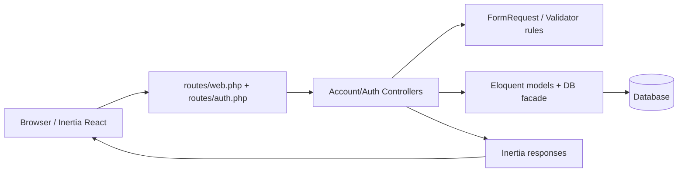

# Detected Stack

| Area | Detection | Confidence | Evidence |
|---|---|---:|---|
| Languages | PHP, TypeScript, TSX, JavaScript | high | `composer.json` requires Laravel/PHP 8.4; `package.json` uses Vite/React; repository blueprint lists `php`, `tsx`, `typescript`, `javascript`. |
| Backend | Laravel 12, Fortify, Sanctum, Inertia Laravel | high | `composer.json` requires `laravel/framework`, `laravel/fortify`, `laravel/sanctum`, `inertiajs/inertia-laravel`. |
| Frontend | React 19, Inertia React, Vite | high | `package.json` dependencies include `react`, `react-dom`, `@inertiajs/react`, `vite`, `@vitejs/plugin-react`. |
| Data layer | Eloquent ORM, Laravel migrations, database sessions | high | `app/Models/User.php`, `app/Models/Session.php`, `database/migrations/*`, `DB::table('sessions')` in `SessionController`. |
| Build/package | Composer, npm/pnpm, Vite | high | `composer.json`, `package.json`, `vite.config.js`, npm scripts. |
| Testing | Pest, Laravel test suite | high | `pestphp/pest`, `pestphp/pest-plugin-laravel`, `tests/Feature/*`, `tests/Unit/*`. |
| Deployment/runtime | Laravel HTTP app with Inertia SSR support | medium | `public/index.php`, `resources/js/ssr.tsx`, `bootstrap/app.php`, `resources/views/app.blade.php`. |

| File | Role |
|---|---|
| `routes/web.php` | route registration / HTTP entry surface |
| `routes/auth.php` | auth-related route registration |
| `app/Http/Controllers/Account/ProfileController.php` | profile controller |
| `app/Http/Controllers/Account/SecurityController.php` | security controller |
| `app/Http/Controllers/Account/SessionController.php` | session management controller |
| `app/Http/Requests/Auth/LoginRequest.php` | login request validation and rate limiting |
| `app/Http/Requests/ProfileUpdateRequest.php` | profile field validation |
| `resources/js/Pages/Profile/Partials/UpdateProfileInformationForm.tsx` | profile edit form |
| `resources/js/Pages/Security/Partials/TwoFactorAuthenticationForm.tsx` | 2FA settings UI |
| `resources/js/components/confirm-with-password.tsx` | password confirmation modal |

# Architectural Context

The application is a layered Laravel monolith with an Inertia/React frontend. Controllers handle HTTP orchestration, FormRequests and Validator rules enforce input constraints, Eloquent handles persistence, and React pages/components render the user-facing account flows.

The clearest boundary is between server-side account management (`app/Http/Controllers/Account/*`, `app/Http/Requests/*`) and client-side account settings UIs (`resources/js/Pages/*`). There is no evidence of microservices or event-driven decomposition; the code is structured as a conventional MVC + SPA hybrid.

## Layers observed

- Presentation: `resources/js/Pages/*`, `resources/js/components/*`
- HTTP orchestration: `routes/*`, `app/Http/Controllers/*`
- Validation: `app/Http/Requests/*`, `Validator::make(...)`
- Data access: `app/Models/*`, `DB::table(...)`
- Infrastructure/config: `config/*`, `bootstrap/*`, `database/migrations/*`

## Dependencies and wiring

- `routes/web.php` wires profile and security controllers into authenticated routes.
- `ProfileController` uses `ProfileUpdateRequest` after the fix, reducing duplicated validation logic.
- `SessionController` directly queries the `sessions` table via `DB` and depends on `config('session.driver') === 'database'`.
- `TwoFactorAuthenticationForm.tsx` depends on Fortify routes such as `two-factor.enable`, `two-factor.confirm`, and `password.confirm`.

## Boundary notes

- `SecurityController::update()` existed in code but was not previously exposed in `routes/web.php`; that made the controller surface inconsistent with the route map.
- `ProfileController::update()` previously duplicated validation that already existed in `ProfileUpdateRequest`, creating drift risk between the request contract and the controller path.

# Data & State Structures

## Persistent data

- `users` table: profile identity, email, verification status, 2FA-related columns inferred from migrations and user model.
- `sessions` table: used by `SessionController` for deleting other or specific sessions.
- Cache/job/tokens tables exist from migrations but are not central to the analyzed feature surface.

## Transient structures

- `LoginRequest` input: `email`, `password`, `remember`.
- `ProfileUpdateRequest` input: `name`, `email`.
- Profile form state: `photoPreview`, `photoInput`, Inertia `useForm` data (`_method`, `name`, `email`, `photo`).
- Two-factor form state: `enabling`, `disabling`, `confirming`, `qrCode`, `recoveryCodes`, `form.code`.

## Caching and state

- No explicit caching layer is used in the analyzed paths.
- Client-side state in the profile and 2FA forms is local React state; no Redux/Context store is present.

# Inputs, Parameters & Contracts

### Inputs & Fields Report
#### Unit: `LoginRequest::rules` / `authenticate` (File: `app/Http/Requests/Auth/LoginRequest.php`)

| # | Name | Scope | Direction/Role | Data Type | Nature | Default | Array? |
|---|------|-------|----------------|-----------|--------|---------|--------|
| 1 | email | Request body | INPUT | string(email) | Mandatory | — | No |
| 2 | password | Request body | INPUT | string | Mandatory | — | No |
| 3 | remember | Request body | INPUT | boolean | Optional | false via `$this->boolean('remember')` | No |

### Inputs & Fields Report
#### Unit: `ProfileUpdateRequest::rules` (File: `app/Http/Requests/ProfileUpdateRequest.php`)

| # | Name | Scope | Direction/Role | Data Type | Nature | Default | Array? |
|---|------|-------|----------------|-----------|--------|---------|--------|
| 1 | name | Request body | INPUT | string | Mandatory | — | No |
| 2 | email | Request body | INPUT | string(email) | Mandatory | — | No |

### Inputs & Fields Report
#### Unit: `ProfileController::update` (File: `app/Http/Controllers/Account/ProfileController.php`)

| # | Name | Scope | Direction/Role | Data Type | Nature | Default | Array? |
|---|------|-------|----------------|-----------|--------|---------|--------|
| 1 | photo | Request file | INPUT | uploaded file | Optional | — | No |
| 2 | name | Request body | INPUT | string | Mandatory | — | No |
| 3 | email | Request body | INPUT | string(email) | Mandatory | — | No |
| 4 | user | Return/context | INPUT-OUTPUT | User model | Derived/Computed | current authenticated user | No |

### Inputs & Fields Report
#### Unit: `SessionController::destroyOtherSessions` / `destroySession` (File: `app/Http/Controllers/Account/SessionController.php`)

| # | Name | Scope | Direction/Role | Data Type | Nature | Default | Array? |
|---|------|-------|----------------|-----------|--------|---------|--------|
| 1 | password | Request body | INPUT | string | Mandatory | — | No |
| 2 | id | Route parameter | INPUT | string | Mandatory | — | No |

### Inputs & Fields Report
#### Unit: `SecurityController::show` / `update` (File: `app/Http/Controllers/Account/SecurityController.php`)

| # | Name | Scope | Direction/Role | Data Type | Nature | Default | Array? |
|---|------|-------|----------------|-----------|--------|---------|--------|
| 1 | sessions | Response prop | OUTPUT | array<session row> | Output | — | Yes |
| 2 | isTwoFactorAuthenticationFeatureEnabled | Response prop | OUTPUT | boolean | Output | — | No |

# Validation Logic

## `email`
- **Category:** Presence / required
  - **Location:** `app/Http/Requests/Auth/LoginRequest.php` `rules()`
  - **Code:** `'email' => ['required', 'string', 'email']`
  - **Triggered:** Always
  - **Effect:** Hard stop on invalid login input.
- **Category:** Type / format
  - **Location:** `app/Http/Requests/Auth/LoginRequest.php` `rules()`
  - **Code:** `'email' => ['required', 'string', 'email']`
  - **Triggered:** Always
  - **Effect:** Rejects malformed addresses.
- **Category:** Presence / required
  - **Location:** `app/Http/Requests/ProfileUpdateRequest.php` `rules()`
  - **Code:** `'email' => ['required', 'string', 'lowercase', 'email', 'max:255', Rule::unique(User::class)->ignore($this->user()->id)]`
  - **Triggered:** Always
  - **Effect:** Hard stop on profile update.
- **Category:** Type / format
  - **Location:** `app/Http/Requests/ProfileUpdateRequest.php` `rules()`
  - **Code:** `'lowercase', 'email', 'max:255'`
  - **Triggered:** Always
  - **Effect:** Enforces canonical email form and length.
- **Category:** Uniqueness
  - **Location:** `app/Http/Requests/ProfileUpdateRequest.php` `rules()`
  - **Code:** `Rule::unique(User::class)->ignore($this->user()->id)`
  - **Triggered:** Always
  - **Effect:** Prevents duplicate email addresses.

## `password`
- **Category:** Presence / required
  - **Location:** `app/Http/Requests/Auth/LoginRequest.php` `rules()`
  - **Code:** `'password' => ['required', 'string']`
  - **Triggered:** Always
  - **Effect:** Hard stop on login.
- **Category:** Presence / required
  - **Location:** `app/Http/Controllers/Account/SessionController.php`
  - **Code:** `'password' => ['required', 'string', 'current_password']`
  - **Triggered:** Always
  - **Effect:** Hard stop before session termination.
- **Category:** Authorization / access
  - **Location:** `app/Http/Controllers/Account/SessionController.php`
  - **Code:** `current_password`
  - **Triggered:** Always
  - **Effect:** Ensures the authenticated user proves control of the account before deleting sessions.

## `name`
- **Category:** Presence / required
  - **Location:** `app/Http/Requests/ProfileUpdateRequest.php` `rules()`
  - **Code:** `'name' => ['required', 'string', 'max:255']`
  - **Triggered:** Always
  - **Effect:** Hard stop on profile update.
- **Category:** Length
  - **Location:** `app/Http/Requests/ProfileUpdateRequest.php` `rules()`
  - **Code:** `'max:255'`
  - **Triggered:** Always
  - **Effect:** Rejects oversized values.

## `photo`
- **Category:** Type / format
  - **Location:** `app/Http/Controllers/Account/ProfileController.php` `update()`
  - **Code:** `'photo' => ['nullable', 'mimes:jpg,jpeg,png', 'max:1024']`
  - **Triggered:** Conditional: only when a file is supplied
  - **Effect:** Hard stop on unsupported image uploads.
- **Category:** Size/range
  - **Location:** same as above
  - **Effect:** Limits upload to 1 MB.

## `remember`
- **Category:** Optional / defaulted
  - **Location:** `app/Http/Requests/Auth/LoginRequest.php` `authenticate()`
  - **Code:** `Auth::attempt(..., $this->boolean('remember'))`
  - **Triggered:** Conditional user choice
  - **Effect:** Defaults to `false` when missing.

## Conditional Dependencies

| Field | Required When | Condition |
|---|---|---|
| `photo` | Conditional Mandatory | When a file is attached, it must satisfy the image/type/size rules. |

# Performance & Stability

- `SessionController::destroyOtherSessions()` and `destroySession()` both perform direct table deletes. That is efficient for the supported database session driver, but they bypass model-level guards and require the `database` session driver to be configured correctly.
- `LoginRequest::ensureIsNotRateLimited()` uses a fixed threshold of 5 attempts. This is a straightforward anti-brute-force measure with no obvious stability risk.
- `UpdateProfileInformationForm.tsx` mutates the `useForm` data object directly before posting (`data.photo = ...`), which is a React-state smell and can become brittle if the form handling library changes semantics.
- No unbounded loops, recursive flows, or obvious N+1 query patterns were observed in the focused surface.

# Security

- **No critical injection issue observed** in the analyzed surface. The route/query access is via Eloquent or parameterized query builder methods, not string concatenation.
- `SessionController::destroySession()` checks ownership before deleting a session row, which avoids a direct object reference on the session id.
- `LoginRequest` rate limits by IP + transliterated email, reducing brute-force risk.
- The password confirmation flow in `ConfirmWithPassword` relies on server-side `password.confirm`, which is appropriate for privileged actions.
- ⚠️ `ProfileController::update()` originally duplicated validation instead of using the dedicated request contract; that inconsistency increases the risk of security drift. The fix aligns the controller with the request object.

# Integration & Connectivity

- Inertia/React pages call named routes through the Ziggy helper (`route(...)`).
- `TwoFactorAuthenticationForm.tsx` uses `axios` for Fortify endpoints and `router.post()` for enable/disable actions.
- `SessionController` depends on the session driver being `database` and the `sessions` table being present.
- `SecurityController::show()` returns `sessions` and a feature flag prop to the frontend.

# Readability, Maintainability & Code Smells

- `ProfileController` previously had duplicated validation logic relative to `ProfileUpdateRequest`; the new flow reduces drift.
- `SecurityController::update()` existed but was not routed. That is dead or incomplete controller surface and was fixed by adding the route.
- `SecurityController::show()` returns data but the page title is still `Profile`, which is a minor UX naming mismatch.
- `TwoFactorAuthenticationForm.tsx` is long and handles multiple flows in one component, but the logic is still cohesive for the 2FA screen.

# Field-Level Analysis

## Totals

- Total fields in scope: 11
- Mandatory fields: 7
- Optional fields: 2
- Defaulted/pre-defaulted fields: 2

## Validation coverage summary

- Input validation: `email`, `password`, `name`, `photo`
- Business validation: rate limiting on login, current-password confirmation before destructive session actions
- Database validation: uniqueness of email, session ownership checks before delete
- Conditional validation: `photo` only when provided, session deletes only when `database` driver is configured

## Missing / inconsistent validation

- `SecurityController::update()` had no route exposure, so its validation contract was unreachable from HTTP.
- `ProfileController::update()` previously bypassed `ProfileUpdateRequest`, making the email normalization rule easy to diverge from the shared request contract.

# Prioritized Findings

| Rank | Severity | Issue | Impact | Effort | Status |
|---|---|---|---|---|---|
| 1 | medium | `ProfileController::update()` duplicated profile validation instead of reusing `ProfileUpdateRequest`. | Medium: contract drift between the request object and controller path. | Low | Fixed |
| 2 | medium | `SecurityController::update()` existed without a route. | Medium: incomplete/unused controller surface and potential future wiring bug. | Low | Fixed |
| 3 | low | `UpdateProfileInformationForm.tsx` mutates `useForm` state directly. | Low: brittle state handling. | Medium | Open |
| 4 | low | `Security/Show.tsx` still uses `Head title="Profile"`. | Low: UX naming mismatch. | Low | Open |

# Summary for Agentic Memory

This repository is a Laravel 12 + Inertia React monolith with Fortify-based auth, Eloquent models, and database-backed session management. The highest-signal surface is account/profile/security management, where route/controller/request contracts, file uploads, password confirmation, and 2FA all converge. I found a consistency bug where profile validation was duplicated in the controller instead of reusing the dedicated request contract, and a route coverage gap where the security update action was not exposed. I fixed both issues on the feature branch by aligning profile updates to `ProfileUpdateRequest` and adding the missing security update route. The remaining notable risks are mostly maintainability issues in the React form layer rather than security or data integrity defects.
