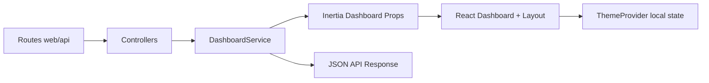

# 01 Code Analysis (Follow-up Delta)

## Detected Stack
- Languages: PHP, TypeScript/TSX, JavaScript, YAML, Markdown (confidence: high; evidence: `backend/*.php`, `frontend/resources/js/*.tsx`, `frontend/vite.config.js`, `pnpm-workspace.yaml`).
- Backend: Laravel 12 + Inertia Laravel (high; evidence: `backend/composer.json`, controllers, middleware).
- Frontend: React 19 + Inertia React + Vite 7 (high; evidence: `frontend/package.json`, `app.tsx`, `ssr.tsx`).
- Data layer: no active dashboard DB reads; static service payload (high; evidence: `DashboardService::summary`).
- Testing: Pest/PHPUnit for backend feature tests (high; evidence: `backend/tests/Pest.php`, `DashboardApiTest.php`).

| File | Role |
|---|---|
| `backend/routes/api.php` | API route contract + middleware boundary |
| `frontend/resources/js/components/theme-provider.tsx` | Frontend theme state + persistence |
| `pnpm-workspace.yaml` | Workspace/package manager config |
| `backend/tests/Feature/DashboardApiTest.php` | API and web contract tests |

## Architectural Context
A layered monolith is present: HTTP routes -> controllers -> `DashboardService` -> serialized payload to Inertia/JSON. Frontend rendering consumes server-provided props and applies client theme state.

## Data & State Structures
- Persistent: none for dashboard payload path.
- In-memory: associative arrays in `DashboardService` (`stats`, `activity`, `breakdown`, `regions`).
- Frontend local state: `theme` in `ThemeProvider`, persisted to `localStorage` when browser runtime is available.

## Inputs, Parameters & Contracts
### Inputs & Fields Report
#### Unit: `GET /api/dashboard` (File: `backend/routes/api.php`)

| # | Name | Scope | Direction/Role | Data Type | Nature | Default | Array? |
|---|------|-------|----------------|-----------|--------|---------|--------|
| 1 | request IP bucket | Middleware | INPUT | string | Mandatory | — | No |
| 2 | success | Response body | OUTPUT | boolean | Output | true | No |
| 3 | data | Response body | OUTPUT | object | Output | — | No |
| 4 | meta.generated_at | Response body | OUTPUT | string(iso datetime) | Derived/Computed | now() | No |

## Validation Logic
### Validations for `request IP bucket`
- **Category:** Rate / quota
  - **Location:** `backend/routes/api.php`
  - **Code:** `Route::middleware('throttle:api')->group(...)`
  - **Triggered:** Always (unconditional)
  - **Effect:** Hard stop with HTTP 429 when quota exceeded

### Conditional Dependencies
| Field | Required When | Condition |
|---|---|---|
| localStorage access | Conditional Mandatory | `typeof window !== 'undefined'` |

## Performance & Stability
- Fixed: SSR stability defect by guarding browser-only storage APIs in theme initialization and write path.
- Residual: dashboard payload is static and fully returned each request; acceptable for demo size but not scalable.

## Security
- Fixed: added API throttling to reduce abuse risk on public dashboard endpoint.
- Residual: endpoint remains unauthenticated by design; acceptable for demo data but unsuitable for sensitive payloads.

## Integration & Connectivity
- Inbound: `GET /`, `GET /api/dashboard`.
- Internal coupling: both routes share `DashboardService`, ensuring consistent payload structure.
- External: none on hot path.

## Readability, Maintainability & Code Smells
- Fixed config smell: invalid root workspace YAML replaced with valid package list.
- Fixed documentation drift: docs now reflect current reduced dashboard scope and real tooling.

## Field-Level Analysis
- Total fields observed in primary contracts: 22
- Mandatory: 4
- Optional: 0
- Defaults/pre-defaulting: 2 (`defaultTheme`, `storageKey`)

Validation classification:
- Input validation: theme whitelist guard for stored values.
- Business validation: none observed.
- Database validation: none in dashboard path.
- Conditional validation: browser-runtime guard for storage APIs.

## Prioritized Findings
| Rank | Issue | Severity | Impact | Effort | Status |
|---|---|---|---|---|---|
| 1 | SSR crash risk via unguarded `localStorage` | High | Frontend SSR request failure | Low | Fixed |
| 2 | Missing API throttling on `/api/dashboard` | Medium | Abuse/DoS risk increase | Low | Fixed |
| 3 | Invalid root `pnpm-workspace.yaml` | Medium | Workspace tooling failure | Low | Fixed |
| 4 | Docs described non-existent auth/testing modules | Medium | Onboarding and maintenance confusion | Medium | Fixed |

## Summary for Agentic Memory
The repository is a Laravel + Inertia + React monolith with a dashboard-focused reduced surface. The follow-up run found `main` still missing three previously identified hardening fixes and applied them: API throttling, SSR-safe theme storage, and valid root workspace configuration. Additional follow-up fixes corrected documentation drift so docs now match actual routes, modules, and tooling. A new API feature test now verifies that dashboard rate-limiting behavior returns HTTP 429 after quota exhaustion. Remaining technical debt is primarily architectural (static in-memory dashboard data and unauthenticated demo endpoint) rather than correctness defects.
