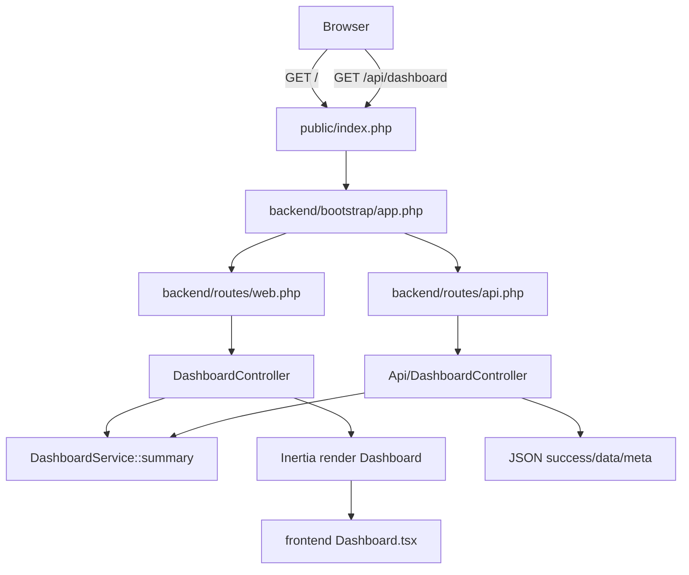

# 01 Code Analysis

## 1) Detected Stack

### Stack Detection Summary
- **Languages (high):** PHP, TypeScript, TSX, JavaScript, Blade template syntax.
  - **Evidence:** `backend/app/Http/Controllers/*.php`, `backend/app/Services/DashboardService.php`, `frontend/resources/js/**/*.tsx`, `frontend/vite.config.js`, `backend/resources/views/app.blade.php`.
- **Backend framework (high):** Laravel 12 + Inertia Laravel.
  - **Evidence:** `backend/composer.json` (`laravel/framework:^12`, `inertiajs/inertia-laravel:^2.0`), bootstrap wiring in `backend/bootstrap/app.php`.
- **Frontend framework (high):** React 19 + Inertia React + Vite.
  - **Evidence:** `frontend/package.json` (`react`, `@inertiajs/react`, `vite`), `frontend/resources/js/app.tsx` using `createInertiaApp`.
- **Data layer (medium):** Laravel DB/session/cache/queue tables on configurable drivers; no domain repository/ORM model usage in opened business code.
  - **Evidence:** `backend/config/database.php`, migration files under `backend/database/migrations`, static data returned by `DashboardService`.
- **Build/deploy/runtime (high):** pnpm workspace + Composer scripts + Vite + Laravel public entrypoint.
  - **Evidence:** root `package.json`, `frontend/vite.config.js`, `public/index.php`, `backend/composer.json` scripts.
- **Testing tooling (high):** Pest + Laravel testing helpers.
  - **Evidence:** `backend/tests/Pest.php`, `backend/tests/Feature/DashboardApiTest.php`, `backend/tests/Feature/ExampleTest.php`.

### Per-file Role Map (opened files)

| File | Role | Confidence | Evidence |
|---|---|---|---|
| `public/index.php` | HTTP entry point | high | Captures request and boots Laravel app |
| `backend/bootstrap/app.php` | Framework wiring / routing bootstrap | high | `withRouting(web, api, health)` and middleware registration |
| `backend/routes/web.php` | Web route definitions | high | `Route::get('/', DashboardController::class)` |
| `backend/routes/api.php` | API route definitions | high | `Route::get('/dashboard', DashboardController::class)` |
| `backend/app/Http/Controllers/DashboardController.php` | Web controller / Inertia adapter | high | `Inertia::render('Dashboard', ...)` |
| `backend/app/Http/Controllers/Api/DashboardController.php` | API controller | high | `response()->json([...])` |
| `backend/app/Services/DashboardService.php` | Business/data provider service | high | `summary(): array` returns dashboard payload |
| `backend/app/Http/Middleware/HandleInertiaRequests.php` | Inertia middleware/shared props | high | Shares `ziggy` payload |
| `backend/config/database.php` | Data source configuration | high | connection map for sqlite/mysql/pgsql/sqlsrv/redis |
| `backend/database/migrations/*` | Schema/migration definitions | high | creates sessions/cache/jobs tables |
| `frontend/resources/js/app.tsx` | Frontend SPA/SSR hydration entry | high | `createInertiaApp` setup |
| `frontend/resources/js/ssr.tsx` | SSR entry + route global injection | high | `createServer`, `global.route` |
| `frontend/resources/js/Pages/Dashboard.tsx` | Dashboard view/component | high | typed props and UI rendering |
| `frontend/resources/js/layouts/AppLayout.tsx` | Shared layout and navigation | high | sidebar, theme toggle, responsive shell |
| `frontend/resources/js/components/theme-provider.tsx` | UI state provider | high | localStorage-backed theme context |
| `frontend/vite.config.js` | Build/dev tooling config | high | Vite config + Laravel plugin |
| `backend/tests/Feature/*.php` | API and page behavior tests | high | asserts JSON shape and Inertia props |

## 2) Architectural Context

- **Observed style:** Layered monolith with split folders (`backend/`, `frontend/`) and an Inertia bridge; server-rendered shell + client React rendering.
- **Layers found:**
  - Presentation: React TSX pages/layout/components.
  - Application/web: Laravel routes/controllers/middleware.
  - Service/data shaping: `DashboardService`.
  - Infrastructure: Laravel config, migrations, Vite/Laravel build glue.
- **Separation quality:** Mostly clean for this scope (controllers delegate to a service); however the service currently embeds large static domain dataset directly in code (tight coupling of mock content to runtime path).
- **Dependency/wiring highlights:**
  - `public/index.php` → `backend/bootstrap/app.php`.
  - Routes resolve invokable controllers.
  - Both controllers depend on `DashboardService`.
  - Web controller returns Inertia component with props; API controller wraps same data in JSON envelope.
  - Frontend resolves page modules dynamically through `import.meta.glob('./Pages/**/*.tsx')`.
- **Boundary risks:** No auth middleware on `/api/dashboard` and `/` route; public-by-default exposure may be intentional for demo but is a production risk.

## 3) Data & State Structures

- **Persistent data structures in scope:** framework tables only (`sessions`, `cache`, `cache_locks`, `jobs`, `job_batches`, `failed_jobs`); no domain entities opened.
- **Read/write patterns:** no runtime DB reads/writes in opened domain service; dashboard payload is in-memory hardcoded arrays.
- **Transient/in-memory structures:**
  - Backend: associative arrays from `DashboardService::summary`.
  - Frontend: typed props (`DashboardProps`) consumed by rendering loops.
  - UI state: `open` sidebar state in `AppLayout`, `theme` state in `ThemeProvider` persisted in `localStorage`.
- **Caching observed:** framework cache store configured (`database` default in `backend/config/cache.php`), but not used by opened dashboard service path.
- **Global mutable state:** `global.route` assignment in SSR setup (`frontend/resources/js/ssr.tsx`) is global mutation by design for Ziggy helper.

## 4) Inputs, Parameters & Contracts

### Inputs & Fields Report
#### Unit: `GET /api/dashboard` (File: `backend/routes/api.php` + `backend/app/Http/Controllers/Api/DashboardController.php`)

| # | Name | Scope | Direction/Role | Data Type | Nature | Default | Array? |
|---|---|---|---|---|---|---|---|
| 1 | request path | Route | INPUT | string literal `/api/dashboard` | Mandatory | — | No |
| 2 | success | Response body | OUTPUT | boolean | Output | `true` | No |
| 3 | data | Response body | OUTPUT | object | Output | from service | No |
| 4 | meta.generated_at | Response body | OUTPUT | string (ISO-8601 datetime) | Derived/Computed | `now()` | No |
| 5 | meta.source | Response body | OUTPUT | string | Output | `php-api` | No |

#### Unit: `GET /` (File: `backend/routes/web.php` + `backend/app/Http/Controllers/DashboardController.php`)

| # | Name | Scope | Direction/Role | Data Type | Nature | Default | Array? |
|---|---|---|---|---|---|---|---|
| 1 | request path | Route | INPUT | string literal `/` | Mandatory | — | No |
| 2 | component | Inertia response | OUTPUT | string | Output | `Dashboard` | No |
| 3 | props | Inertia response | OUTPUT | object (`summary`) | Output | from service | No |

#### Unit: `DashboardService::summary` (File: `backend/app/Services/DashboardService.php`)

| # | Name | Scope | Direction/Role | Data Type | Nature | Default | Array? |
|---|---|---|---|---|---|---|---|
| 1 | stats | Return | OUTPUT | array<object> | Output | hardcoded | Yes |
| 2 | activity | Return | OUTPUT | array<object> | Output | hardcoded | Yes |
| 3 | breakdown | Return | OUTPUT | array<object> | Output | hardcoded | Yes |
| 4 | regions | Return | OUTPUT | array<object> | Output | hardcoded | Yes |

#### Unit: `Dashboard` component props (File: `frontend/resources/js/Pages/Dashboard.tsx`)

| # | Name | Scope | Direction/Role | Data Type | Nature | Default | Array? |
|---|---|---|---|---|---|---|---|
| 1 | stats | Parameter | INPUT | `{key,label,value,hint}[]` | Mandatory | — | Yes |
| 2 | activity | Parameter | INPUT | `{name,phone,module,status,region,updated}[]` | Mandatory | — | Yes |
| 3 | breakdown | Parameter | INPUT | `{label,count,percent,color}[]` | Mandatory | — | Yes |
| 4 | regions | Parameter | INPUT | `{region,records}[]` | Mandatory | — | Yes |

#### Unit: `ThemeProvider` (File: `frontend/resources/js/components/theme-provider.tsx`)

| # | Name | Scope | Direction/Role | Data Type | Nature | Default | Array? |
|---|---|---|---|---|---|---|---|
| 1 | children | Parameter | INPUT | `React.ReactNode` | Mandatory | — | No |
| 2 | defaultTheme | Parameter | INPUT | `'light'|'dark'` | Optional | `'light'` | No |
| 3 | storageKey | Parameter | INPUT | string | Optional | `'vite-ui-theme'` | No |

## 5) Validation Logic

### Validations for `status` (activity row)
- **Category:** Enumeration / allowed values
  - **Location:** `frontend/resources/js/Pages/Dashboard.tsx` line hint ~12 (`type Status = 'active' | 'paused' | 'failed'`)
  - **Code:** `type Status = 'active' | 'paused' | 'failed';`
  - **Triggered:** Compile-time/type-check time
  - **Effect:** Hard type error in TS builds if unsupported status value is passed

### Validations for `theme`
- **Category:** Enumeration / allowed values
  - **Location:** `frontend/resources/js/components/theme-provider.tsx` line hint ~3
  - **Code:** `type Theme = 'dark' | 'light';`
  - **Triggered:** Compile-time/type-check time
  - **Effect:** Constrains setter input and provider state shape

### Validations for `sessions.id`
- **Category:** Presence / required + uniqueness
  - **Location:** `backend/database/migrations/0001_01_01_000000_create_sessions_table.php` line hint ~14
  - **Code:** `$table->string('id')->primary();`
  - **Triggered:** Always at DB write time
  - **Effect:** Hard stop on null/duplicate primary key

### Validations for `sessions.payload`
- **Category:** Presence / required
  - **Location:** `backend/database/migrations/0001_01_01_000000_create_sessions_table.php` line hint ~18
  - **Code:** `$table->longText('payload');`
  - **Triggered:** Always
  - **Effect:** DB rejects null payload

### Validations for `cache.key` and `cache_locks.key`
- **Category:** Presence / required + uniqueness
  - **Location:** `backend/database/migrations/0001_01_01_000001_create_cache_table.php` line hints ~14 and ~20
  - **Code:** `$table->string('key')->primary();`
  - **Triggered:** Always
  - **Effect:** DB-level uniqueness and non-null enforcement

### Validations for `failed_jobs.uuid`
- **Category:** Uniqueness
  - **Location:** `backend/database/migrations/0001_01_01_000002_create_jobs_table.php` line hint ~40
  - **Code:** `$table->string('uuid')->unique();`
  - **Triggered:** Always
  - **Effect:** Hard stop on duplicate UUID

### Conditional Dependencies
| Field | Required When | Condition |
|---|---|---|
| — | — | No explicit cross-field conditional validation observed in opened files |

⚠️ **Missing/inconsistent validation note:** Runtime request validation classes/form requests were not observed for dashboard endpoints; current routes have no input payload, but future extensibility should add explicit request contracts if parameters are introduced.

## 6) Performance & Stability

- **Medium:** `DashboardService::summary` returns a large static structure on every request; repeated allocation can be moved to cache/config/fixture storage.
- **Low:** API and page both call same service synchronously each request; acceptable now, but no memoization/cache layer exists if payload grows.
- **Low:** `ThemeProvider` reads from `localStorage` during state initialization; safe for client render path, but SSR safety relies on current usage (provider is in client layout path).
- **Low:** No unbounded loops over remote data observed; frontend loops over bounded arrays supplied by backend static payload.
- **Low:** No explicit error handling around service path; currently low risk because service has no I/O and deterministic output.

## 7) Security

- **High:** `/api/dashboard` is publicly accessible (no auth/ability middleware observed on route), which may leak operational metadata in non-demo deployments.
- **Medium:** Root dashboard route `/` is also public by default; if this UI should be restricted, access control is missing.
- **Low:** No SQL string concatenation, command execution, deserialization, or template injection vectors were observed in opened files.
- **Low:** Credentials are not hardcoded in opened source; configs rely on environment variables (`DB_*`, `AWS_*`, `SESSION_*`).
- **Info:** `backend/config/session.php` defaults include secure patterns (`http_only=true`, `same_site=lax`) but `SESSION_SECURE_COOKIE` depends on environment setup.

## 8) Integration & Connectivity

- **Inbound surfaces:**
  - `GET /` → Inertia dashboard page.
  - `GET /dashboard` → redirect to `/`.
  - `GET /api/dashboard` → JSON summary.
  - `GET /up` health endpoint from bootstrap routing.
- **Outbound/in-process integrations:**
  - Inertia Laravel adapter (`Inertia::render`).
  - Ziggy route metadata shared via middleware.
  - Vite plugin integrates frontend build with Laravel public directory/hot file.
- **Config/env coupling:** Strong reliance on env-driven config in `backend/config/*.php`; production behavior depends on deployment-time env correctness.
- **Contract coupling risk:** Frontend `DashboardProps` and API response shape are tightly coupled to hardcoded `DashboardService` keys; no schema versioning.

## 9) Readability, Maintainability & Code Smells

- **Medium:** `DashboardService` is monolithic mock-data blob (single file with many literal records); should be split into domain modules or repository-backed providers.
- **Medium:** Repeated string keys (`stats`, `activity`, `breakdown`, `regions`) across backend and frontend without shared runtime schema validation.
- **Low:** Naming is mostly clear and idiomatic for Laravel/React.
- **Low:** Tests cover happy-path contracts but not negative/access-control/error cases.
- **Info:** Routing/controllers are concise and easy to follow.

## 10) Field-Level Analysis

- **Total fields analyzed:** 65
- **Mandatory fields:** 53
- **Optional fields:** 12
- **Fields with defaults / pre-defaulting:** 10

### Validation Classification
- **Input validation:** TS enum constraints for `status` and `theme`; typed props for dashboard structures.
- **Business validation:** Minimal explicit runtime business rules in opened files (mostly static data projection).
- **Database validation:** Primary keys, unique constraints, nullable/non-nullable column definitions in migration set.
- **Conditional validation:** None observed.

### Field/validation gaps
- Missing runtime server-side validation artifacts for dashboard payload contracts (acceptable for current no-input endpoints, but fragile under change).
- No explicit auth/authorization field checks around route access.

## 11) Prioritized Findings

| Rank | Finding | Severity | Impact | Effort | Recommendation |
|---|---|---|---|---|---|
| 1 | Public `/api/dashboard` without auth guard | high | Data exposure risk | low | Add auth middleware and policy/ability checks for API route |
| 2 | Public `/` dashboard without access control | medium | UI and metadata exposure | low | Protect web route with auth middleware when not demo mode |
| 3 | Monolithic static dataset in `DashboardService` | medium | Maintainability and scalability constraints | medium | Split into modular providers (stats/activity/region modules) and optionally cache |
| 4 | Contract duplication between backend arrays and TS props | medium | Drift risk causing runtime UI failures | medium | Introduce shared schema contract (OpenAPI/JSON schema or generated TS types) |
| 5 | Limited test depth on security/error flows | medium | Regressions can ship unnoticed | medium | Add feature tests for unauthorized access, malformed payload, and contract failures |
| 6 | Env-driven security flags not enforced in code | low | Deployment misconfiguration risk | low | Add production config assertions/health checks for secure cookie + HTTPS |

## 12) Summary for Agentic Memory

This repository is a split-folder Laravel 12 + Inertia React monolith with clear routing/controller/service/view layering and Vite-based frontend tooling. The current dashboard feature is driven by `DashboardService::summary`, which returns static in-memory data consumed both by a web Inertia endpoint and a JSON API endpoint. Database-related files in scope are framework migrations and configs (sessions/cache/jobs), while no domain persistence logic was observed in opened business paths. Validation is mostly structural (TypeScript enums/types and migration constraints), with little explicit runtime business validation because the endpoints currently accept no input payload. The highest-priority risks are missing access control on dashboard routes and maintainability drift from duplicated backend/frontend contracts around dashboard data shape.
