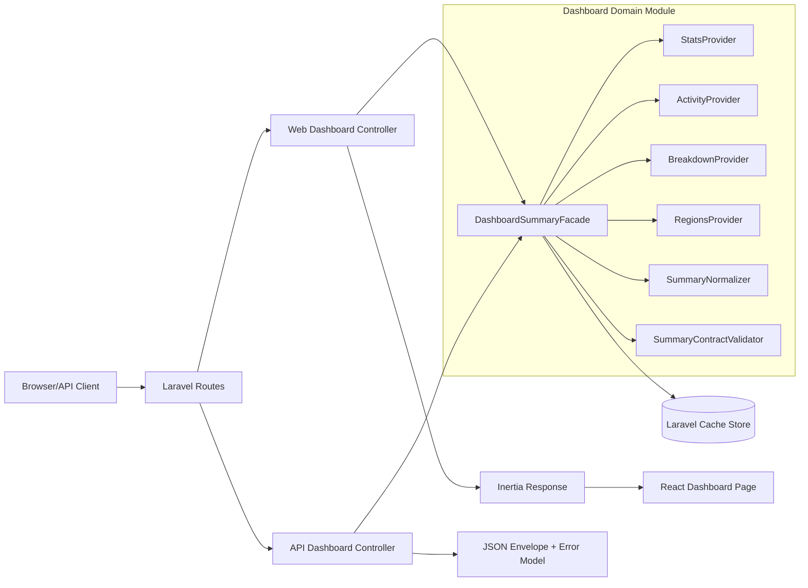
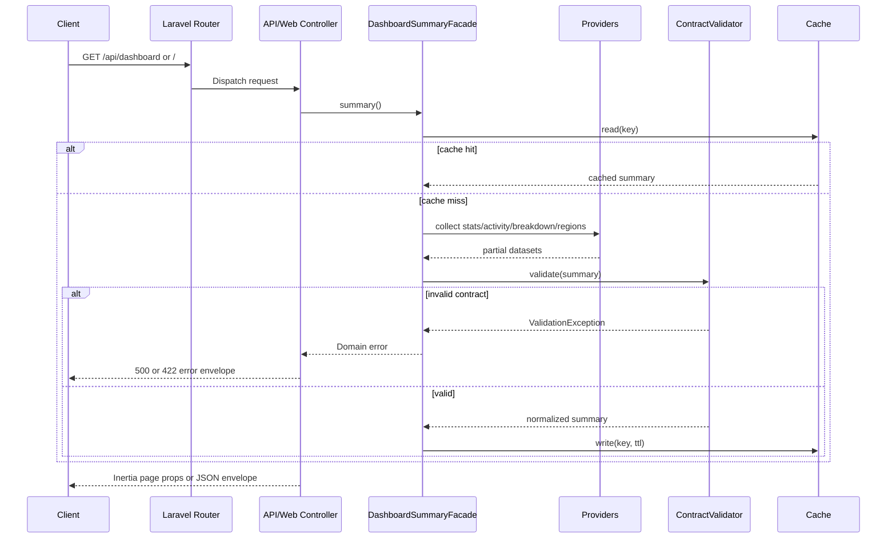
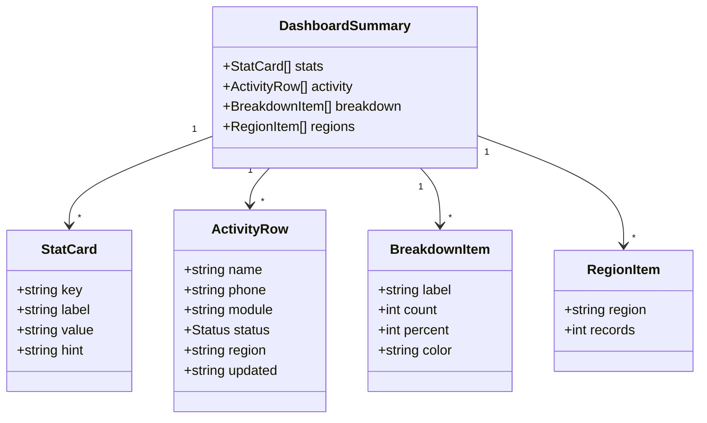

# 02 Design Document

## I. Executive Summary

This design modularizes the current dashboard implementation in `ksabai-gl/react-inertia-laravel` from a single hardcoded service into cohesive backend domain modules and aligned frontend contracts, while preserving existing behavior for `GET /` and `GET /api/dashboard`.

**Target users:** internal developers maintaining dashboard/API behavior and product teams extending IVR dashboard data.

**Primary value proposition:** lower change risk and faster feature delivery by splitting monolithic data construction into isolated providers, explicit contracts, and guarded routes.

**Measurable success criteria**
- Dashboard payload contract remains backward compatible for current consumers (`stats`, `activity`, `breakdown`, `regions`).
- All dashboard route access follows explicit auth policy (demo/public mode configurable).
- New/updated tests cover contract shape, authorization paths, and provider aggregation behavior.
- Dashboard summary generation latency remains within current baseline (target: p95 <= 150 ms for current static dataset).

**Detected stack (high confidence):** Laravel 12 (PHP 8.4) backend with Inertia Laravel, React 19 + Inertia React frontend, Vite build pipeline, Pest testing, and Laravel-configured DB/cache/queue backends. Confidence is high based on `analysis_output.json.detected_stack` and repository manifests.

**Scope boundary**
- **In scope:** Modularization within existing Laravel + Inertia + React stack, contract hardening, validation strategy, access control design, and deployment/testing impacts.
- **Out of scope:** Rewriting to a different language/framework, introducing new persistence technologies, or redesigning unrelated app domains.

## II. System Architecture

### High-Level Diagram (Mermaid)



### Component Breakdown

| Component | Responsibility | Inputs | Outputs | Boundaries |
|---|---|---|---|---|
| `backend/routes/web.php` | Route to dashboard page and legacy redirect | HTTP GET `/`, `/dashboard` | Controller invocation / redirect | No business logic |
| `backend/routes/api.php` | Route to dashboard JSON API | HTTP GET `/api/dashboard` | Controller invocation | No business logic |
| `DashboardController` (web) | Inertia adapter for dashboard page | Request context | `Inertia::render('Dashboard', summary)` | No data shaping beyond adapter |
| `Api\DashboardController` | JSON API adapter and envelope | Request context | `{success,data,meta}` | No domain computation |
| `DashboardSummaryFacade` (new) | Aggregates providers, applies validation and caching | Optional filter/query DTO (future-safe) | Canonical summary DTO/array | Single orchestration point |
| `StatsProvider` (new) | Produces summary stat cards | Domain source | `stats[]` | Isolated from API/web concerns |
| `ActivityProvider` (new) | Produces activity rows | Domain source | `activity[]` | Own field-level validation |
| `BreakdownProvider` (new) | Produces status distribution | Activity set | `breakdown[]` | Derivation logic isolated |
| `RegionsProvider` (new) | Produces region totals | Activity set | `regions[]` | Derivation logic isolated |
| `SummaryContractValidator` (new) | Runtime contract guard and normalization checks | Aggregated summary | Validated summary / domain exception | Unified validation/error source |
| React `Dashboard.tsx` | Presentation and local UI rendering | `DashboardProps` | UI output | No transport/business logic |

### Primary Sequence Diagram (Mermaid)



### Cross-Cutting Concerns

- **Logging:** structured Laravel logs with context keys: `route`, `request_id`, `module=dashboard`, `provider`, `duration_ms`, `cache_hit`.
- **Error handling:** central error formatter (Laravel exception handler mapping to API envelope; Inertia fallback page for web).
- **Configuration:** `config/dashboard.php` for access mode, cache TTL, and optional feature toggles.
- **Observability:** metrics per provider latency and cache effectiveness.

## III. Data Model

Current dashboard data is non-persistent domain projection; framework persistence exists for sessions/cache/jobs. Modularization introduces domain DTO/contracts without requiring immediate schema changes.

### Domain Summary Schema

| Entity/Schema | Description | Cardinality | Constraints |
|---|---|---|---|
| `DashboardSummary` | Root payload for dashboard | 1 per request | Must contain `stats`,`activity`,`breakdown`,`regions` |
| `StatCard` | KPI card item | 0..n | `key` unique within array |
| `ActivityRow` | Recent run record | 0..n | `status` enum, `name` required |
| `BreakdownItem` | Status aggregate | 0..n | `percent` range 0..100 |
| `RegionItem` | Region aggregate | 0..n | `records` non-negative integer |

### Field Specification Table

| Field | Type | Format/Size | Nullable | Mandatory/Optional/Default | Validation Class | Current Behavior | Target Behavior |
|---|---|---|---|---|---|---|---|
| `stats[].key` | string | <= 64 | No | Mandatory | Input | Provided by service literal | Enforce non-empty + uniqueness |
| `stats[].label` | string | <= 120 | No | Mandatory | Input | Provided by service literal | Enforce non-empty |
| `stats[].value` | string | <= 32 | No | Mandatory | Input | Provided by service literal | Enforce non-empty |
| `stats[].hint` | string | <= 160 | No | Mandatory | Input | Provided by service literal | Enforce non-empty |
| `activity[].name` | string | <= 160 | No | Mandatory | Input | Provided by service literal | Enforce non-empty |
| `activity[].phone` | string | <= 32 | No | Mandatory | Input | Provided by service literal | Enforce phone display format pattern |
| `activity[].module` | string | <= 80 | No | Mandatory | Input | Provided by service literal | Enforce known module values/config |
| `activity[].status` | enum string | `active|paused|failed` | No | Mandatory | Input/Business | TS compile-time only | Add runtime backend enum validation |
| `activity[].region` | string | ISO country-like code <= 8 | No | Mandatory | Input | Provided by service literal | Enforce uppercase format |
| `activity[].updated` | string | display datetime <= 40 | No | Mandatory | Input | Provided by service literal | Normalize display or ISO source + formatter |
| `breakdown[].label` | string | <= 40 | No | Mandatory | Business | Provided by service literal | Enforce label consistency with status map |
| `breakdown[].count` | integer | >= 0 | No | Mandatory | Business | Provided by service literal | Validate against activity counts |
| `breakdown[].percent` | integer | 0..100 | No | Mandatory | Business | Provided by service literal | Validate sum ~100 (+/- 1 rounding) |
| `breakdown[].color` | string | hex color | No | Mandatory | Input | Provided by service literal | Validate CSS hex pattern |
| `regions[].region` | string | <= 8 | No | Mandatory | Input | Provided by service literal | Enforce uppercase |
| `regions[].records` | integer | >= 0 | No | Mandatory | Business | Provided by service literal | Validate derived/non-negative |
| `meta.generated_at` (API) | string | ISO-8601 | No | Default (`now()`) | Conditional/Output | Set in controller | Keep behavior |
| `meta.source` (API) | string | <= 32 | No | Default (`php-api`) | Output | Set in controller | Keep behavior; move to config constant |
| `ThemeProvider.defaultTheme` | enum | `light|dark` | No | Optional default `light` | Input | Frontend default parameter | Keep behavior |
| `ThemeProvider.storageKey` | string | <= 64 | No | Optional default `vite-ui-theme` | Input | Frontend default parameter | Keep behavior |

### Storage Strategy and Migration Notes

- **Storage type:** Remains stack-native Laravel data stores; dashboard summary remains computed projection (no mandatory domain table in this enhancement).
- **Caching:** Use existing Laravel cache store (`config/cache.php`) with namespaced key `dashboard.summary.v1` and short TTL (e.g., 60s) to reduce repeated allocations.
- **Schema migration:** Not required for minimal modularization; if future persistence is introduced, add additive migrations only.
- **Rollback:** Disable new providers via config flag and fall back to legacy service adapter class.

### ER/Class Diagram (Mermaid)



## IV. API / Interface Design

### HTTP Contracts

| Interface | Method | Path/Signature | Auth | Request | Success Response | Errors | Idempotency |
|---|---|---|---|---|---|---|---|
| Dashboard API | GET | `/api/dashboard` | Configurable: public (demo) or `auth` middleware + policy | None | `200` JSON `{success,data,meta}` | `401`,`403`,`500` (and `422` if query params introduced) | Yes |
| Dashboard Web | GET | `/` | Configurable: public (demo) or `auth` middleware | None | `200` Inertia page `Dashboard` with props | `302` (auth redirect), `500` | Yes |
| Legacy Redirect | GET | `/dashboard` | Same as `/` policy | None | `302` -> `/` | `500` | Yes |

### API Response Shape (Primary)

```json
{
  "success": true,
  "data": {
    "stats": [{ "key": "records", "label": "Total Test Records", "value": "23", "hint": "17 active" }],
    "activity": [{ "name": "US Toll-Free Regression Suite", "phone": "+1 (800) 555-0101", "module": "Regression Tests", "status": "active", "region": "US", "updated": "17 Jun, 13:10" }],
    "breakdown": [{ "label": "Active", "count": 17, "percent": 74, "color": "#10b981" }],
    "regions": [{ "region": "US", "records": 6 }]
  },
  "meta": {
    "generated_at": "2026-07-21T09:00:00Z",
    "source": "php-api"
  }
}
```

### Standard Error Envelope (Proposed)

```json
{
  "success": false,
  "error": {
    "code": "DASHBOARD_CONTRACT_INVALID",
    "message": "Dashboard summary contract validation failed.",
    "details": [{ "field": "activity[2].status", "rule": "enum", "expected": ["active","paused","failed"] }]
  },
  "meta": {
    "generated_at": "2026-07-21T09:00:00Z",
    "request_id": "..."
  }
}
```

### Backward Compatibility and Versioning

- Keep `GET /api/dashboard` shape unchanged for v1.
- Introduce internal contract version tag (`dashboard.summary.v1`) for cache key and validator profile.
- If a breaking field change is needed later, add `/api/v2/dashboard` and parallel frontend type namespace.

## V. Business Logic & Validation Design

### Workflow Logic (Ordered)

1. Controller delegates to `DashboardSummaryFacade`.
2. Facade checks cache by contract version + tenant/context key.
3. On cache miss, providers generate `stats`, `activity`, `breakdown`, `regions`.
4. `SummaryNormalizer` applies deterministic sorting/formatting (e.g., region uppercase, stable order).
5. `SummaryContractValidator` applies input/business/db/conditional rules.
6. Valid payload cached and returned to controller.
7. Controller wraps with transport-specific envelope (Inertia props or JSON + meta).

### Validation Matrix

| Field/Input | Input Validation | Business Validation | Database Validation | Conditional Validation | Error/Behavior | Gap to Close |
|---|---|---|---|---|---|---|
| `activity[].status` | enum `active|paused|failed` | status contributes to breakdown buckets | N/A | N/A | On invalid: `422` with `DASHBOARD_FIELD_INVALID` (future input mode) or `500` with contract-invalid log for internal data faults | Backend runtime enum validation missing today |
| `breakdown[].percent` | integer 0..100 | sum consistency with counts and total activity | N/A | Allow +/-1 for rounding | Invalid -> `DASHBOARD_CONTRACT_INVALID` | No runtime consistency check today |
| `breakdown[].count` | integer >=0 | equals grouped activity counts | N/A | N/A | Invalid -> contract error | No cross-check today |
| `stats[].key` | non-empty string | unique list key | N/A | N/A | Invalid -> contract error | No uniqueness enforcement today |
| `regions[].records` | integer >=0 | aligns with activity aggregation | N/A | N/A | Invalid -> contract error | No aggregation check today |
| route access `/api/dashboard` | N/A | authorized role/scope required in non-demo mode | auth guard/session | Env-driven access mode | Unauthorized -> `401`/`403` | Missing explicit auth guard today |
| route access `/` | N/A | authorized session required in non-demo mode | auth guard/session | Env-driven access mode | Redirect/login or `403` | Missing explicit auth guard today |
| `ThemeProvider.defaultTheme` | enum `light|dark` | N/A | N/A | default applied when absent | Fallback `light` | Already covered |
| `ThemeProvider.storageKey` | string non-empty | N/A | N/A | default when absent | Fallback `vite-ui-theme` | Already covered |

### Consistent Error Model

- API uses envelope with `success=false`, `error.code`, `error.message`, `error.details[]`, `meta.request_id`.
- Web uses Inertia error boundary page plus server logs keyed by `request_id`.
- Contract violations are always logged at `error` severity with provider context.

## VI. Infrastructure & DevOps

### Deployment and Runtime

- **Target runtime:** existing Laravel + React deployment (containers/VM supported by current project scripts).
- **No platform migration:** retain Composer + pnpm + Vite and Laravel entrypoint.
- **Config additions:** `DASHBOARD_ACCESS_MODE` (`public|auth`), `DASHBOARD_CACHE_TTL`, optional `DASHBOARD_CONTRACT_STRICT`.

### CI/CD Requirements

- Backend checks: `composer test` (Pest), `php artisan test`, `php artisan config:cache` sanity.
- Frontend checks: `pnpm --dir frontend lint`, `pnpm --dir frontend build`.
- Contract checks: add backend unit tests for provider outputs and contract validator.
- Release gating: block deploy if auth-mode tests or contract tests fail.

### Environments and Secrets

- Use existing `.env` model; do not hardcode secrets.
- Ensure production `SESSION_SECURE_COOKIE=true` and HTTPS terminates correctly.

### Observability

- Metrics: `dashboard_summary_latency_ms`, `dashboard_cache_hit_ratio`, `dashboard_contract_failures_total`.
- Logs: structured JSON logs with `module=dashboard` and `provider` fields.
- Health: keep `/up`; add optional dashboard self-check probe for contract generation.

## VII. Security & Compliance

### Authentication/Authorization

- Add explicit middleware strategy:
  - Demo mode: public routes allowed.
  - Non-demo mode: `auth` middleware on `/` and `/api/dashboard`; optional ability/role check for dashboard view/API.
- Prefer Laravel policy/gate naming: `viewDashboard` (web) and `viewDashboardApi` (API).

### Data Protection

- In transit: HTTPS required in production.
- At rest: rely on configured DB/cache encryption capabilities as deployed.
- Secrets: remain environment-managed.
- Input/output safety: strict serialization from validated DTOs only.

### Security Findings Coverage Mapping

| Finding (from analysis) | Mitigation in design | Residual risk |
|---|---|---|
| Public `/api/dashboard` access | Route auth middleware + policy + env switch for demo mode | Misconfiguration risk if env defaults are wrong |
| Public `/` dashboard access | Same auth/policy control for web route | Demo mode intentionally public |
| Contract drift between PHP and TS | Runtime validator + typed DTO + test contract assertions | Requires discipline to update both schemas |

### Compliance Notes

- Potential PII in activity names/phone numbers: add data-classification tags and avoid verbose logs for payload bodies.
- Audit logging: record access decisions for protected dashboard endpoints in non-demo mode.

## VIII. Enhancement / Implementation Strategy

### Impact Analysis

- **Business impact:** Improved reliability for future dashboard enhancements; configurable access control protects potentially sensitive operational data.
- **Technical impact:** Adds modular provider layer and contract validator; minimal endpoint contract changes.
- **Risk impact:** Reduces monolithic coupling but introduces additional classes and config paths.
- **Blast radius:** `backend/routes/*`, dashboard controllers, `DashboardService` replacement/adaptation, backend tests, frontend type definitions, and CI checks.

### Ordered Minimal Delivery Steps

1. **Introduce domain contracts** (`DashboardSummary`, row/value objects, validator rules) while preserving current response schema.
2. **Split monolithic service** into `DashboardSummaryFacade` + four providers, each with focused responsibility.
3. **Add runtime contract validation** and centralized error mapping.
4. **Add cache layer** in facade with configurable TTL and contract-versioned key.
5. **Apply access policy** to web/API routes via env-driven middleware mode.
6. **Update tests**: provider unit tests, API auth tests, contract regression tests, and existing happy-path retention.
7. **Observability hardening**: add structured logging + dashboard metrics.
8. **Rollout/cutover**: deploy with default `public` mode for compatibility, then flip to `auth` in secured environments.

### Scope Boundary

Enhancement remains inside Laravel + Inertia + React architecture. No rewrite to another language or platform is proposed.

## IX. Traceability

| Design Decision | Source Evidence | Rationale |
|---|---|---|
| Keep Laravel + Inertia + React stack | `analysis_output.json.detected_stack`, `backend/composer.json`, `frontend/package.json` | High-confidence detected stack and existing deployment model |
| Modularize `DashboardService` into providers/facade | `analysis_output.json.issues[1]`, `01-code-analysis.md` maintainability findings | Monolithic hardcoded blob is main maintainability bottleneck |
| Preserve current API response shape | `backend/app/Http/Controllers/Api/DashboardController.php`, feature tests | Backward compatibility for existing consumers/tests |
| Add runtime contract validator | `analysis_output.json.issues[2]` (contract duplication risk) | Prevent backend/frontend schema drift at runtime |
| Add auth guard strategy for `/` and `/api/dashboard` | `analysis_output.json.security_findings` high/medium | Close broken-access-control findings with environment-aware policy |
| Add contract and auth regression tests | `analysis_output.json.issues[3]`, existing tests only happy-path | Reduce regression risk across security and payload evolution |
| Use cache for summary | `analysis_output.json.performance_findings` | Reduce repeated allocation and future data-source cost |
| Keep no schema migration for MVP modularization | Current service is static projection; no domain persistence observed | Minimize change risk and delivery time |

**Related ticket key:** Not provided in inputs.

## X. Open Questions & Risks

| ID | Open Question / Risk | Assumption Made | Mitigation | Owner / Decision Needed |
|---|---|---|---|---|
| Q1 | Should dashboard be public in production? | Default remains public for compatibility, but non-demo should require auth | Add `DASHBOARD_ACCESS_MODE` and secure environment checklist | Product + Security |
| Q2 | Source of truth for dashboard data (static vs DB/external)? | Continue static/mock-like provider outputs in this phase | Define adapter interface now to allow DB/API source later | Backend Lead |
| Q3 | Error code taxonomy not yet standardized across APIs | Use proposed `DASHBOARD_*` codes for this module | Align with global API error convention in next platform pass | Platform Team |
| Q4 | Frontend/backend schema drift over time | Runtime validator + tests will catch drift | Consider generated shared schema later (e.g., OpenAPI/JSON schema) | Full-stack Team |
| Q5 | Cache staleness vs freshness tradeoff | TTL default 60s is acceptable for dashboard summary | Make TTL configurable and monitor hit/freshness metrics | SRE / Backend |
| Q6 | Potential PII exposure in logs | Avoid logging payload values by default | Add log redaction policy and test for sensitive fields | Security + Observability |
