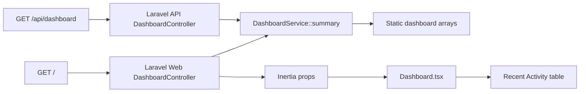

# Code Analysis Report

## Detected Stack

| Area | Detection | Confidence | Evidence |
|---|---|---:|---|
| Languages | PHP 8.4, TypeScript/TSX, JavaScript | High | `backend/composer.json` requires `php:^8.4`; `Dashboard.tsx`, `app.tsx`, `vite.config.js`; blueprint counts php:33, tsx:4, typescript:4, javascript:3 |
| Backend | Laravel 12 with Inertia Laravel | High | `laravel/framework:^12`, `inertiajs/inertia-laravel:^2.0`; controllers return Inertia/JSON responses |
| Frontend | React 19, Inertia React, Vite, Tailwind utility styling | High | `@inertiajs/react`, `react:^19.2.7`, `vite`, `tailwindcss`; `Dashboard.tsx` renders JSX with utility classes |
| Data layer | Static in-memory dashboard data, no persistent dashboard model observed | High | `DashboardService::summary()` returns hard-coded arrays; migrations exist for sessions/cache/jobs only in blueprint |
| Build/deploy | Composer backend, npm/pnpm frontend, Vite SSR build | High | `backend/composer.json` scripts and `frontend/package.json` scripts: `vite build && vite build --ssr` |
| Testing | Pest PHP tests; frontend lint/format only observed | Medium | `pestphp/pest`, `pestphp/pest-plugin-laravel`; `frontend/package.json` has ESLint/Prettier scripts, no frontend test runner |

| File | Role | Notes |
|---|---|---|
| `backend/routes/web.php` | Web route definition | Maps `/` to the Inertia dashboard and redirects `/dashboard` to `/` |
| `backend/routes/api.php` | API route definition | Maps `GET /api/dashboard` to JSON dashboard controller |
| `backend/app/Http/Controllers/DashboardController.php` | Web controller | Injects `DashboardService` and renders the `Dashboard` Inertia page |
| `backend/app/Http/Controllers/Api/DashboardController.php` | API controller | Returns JSON envelope with `success`, `data`, and `meta` |
| `backend/app/Services/DashboardService.php` | Service/data provider | Supplies dashboard summary arrays |
| `frontend/resources/js/Pages/Dashboard.tsx` | React/Inertia page | Presents stats, recent activity, status breakdown, and regions; requested filter controls belong above Recent Activity |

## Architectural Context

The observed architecture is a small Laravel/Inertia layered monolith. Routes dispatch to thin controllers, controllers delegate dashboard data assembly to `DashboardService`, and the Inertia React page renders presentation-only UI from typed props. There is also an API route exposing the same summary through a JSON envelope, creating a simple shared service boundary between web and API surfaces.

No circular dependencies were observed in the opened files. The primary boundary risk is contract drift between PHPDoc shapes in `DashboardService` and TypeScript prop types in `Dashboard.tsx`, since there is no shared schema or generated type contract.

## Data & State Structures

Persistent dashboard data is not used in the analyzed surface. `DashboardService::summary()` returns transient arrays for `stats`, `activity`, `breakdown`, and `regions`. The React page receives those arrays as immutable props and currently has no component state. Adding client-side filters will introduce local state for selected module, status, and region values derived from `activity`.

## Inputs, Parameters & Contracts

### Inputs & Fields Report
#### Unit: `DashboardService::summary` (File: `backend/app/Services/DashboardService.php`)

| # | Name | Scope | Direction/Role | Data Type | Nature | Default | Array? |
|---|------|-------|----------------|-----------|--------|---------|--------|
| 1 | stats | Return field | OUTPUT | list<object> | Output | Hard-coded array | Yes |
| 2 | stats[].key | Return sub-field | OUTPUT | string | Enumerated by UI icon map | `records`, `phones`, `alerts`, `countries` | No |
| 3 | stats[].label | Return sub-field | OUTPUT | string | Output | Hard-coded | No |
| 4 | stats[].value | Return sub-field | OUTPUT | string | Output | Hard-coded | No |
| 5 | stats[].hint | Return sub-field | OUTPUT | string | Output | Hard-coded | No |
| 6 | activity | Return field | OUTPUT | list<object> | Output | Hard-coded array | Yes |
| 7 | activity[].name | Return sub-field | OUTPUT | string | Output | Hard-coded | No |
| 8 | activity[].phone | Return sub-field | OUTPUT | string | Output | Hard-coded | No |
| 9 | activity[].module | Return sub-field | OUTPUT | string | Enumerated by sample data | `Regression Tests`, `Discovery Scans` | No |
| 10 | activity[].status | Return sub-field | OUTPUT | string | Enumerated | `active`, `paused`, `failed` | No |
| 11 | activity[].region | Return sub-field | OUTPUT | string | Enumerated by sample data | Country/region codes | No |
| 12 | activity[].updated | Return sub-field | OUTPUT | string | Output | Display string | No |
| 13 | breakdown | Return field | OUTPUT | list<object> | Output | Hard-coded array | Yes |
| 14 | breakdown[].label | Return sub-field | OUTPUT | string | Enumerated by sample data | `Active`, `Paused`, `Failed`, `Other` | No |
| 15 | breakdown[].count | Return sub-field | OUTPUT | int | Output | Hard-coded | No |
| 16 | breakdown[].percent | Return sub-field | OUTPUT | int | Output | Hard-coded | No |
| 17 | breakdown[].color | Return sub-field | OUTPUT | string | Output | Hex color literal | No |
| 18 | regions | Return field | OUTPUT | list<object> | Output | Hard-coded array | Yes |
| 19 | regions[].region | Return sub-field | OUTPUT | string | Output | Hard-coded region code | No |
| 20 | regions[].records | Return sub-field | OUTPUT | int | Output | Hard-coded | No |

#### Unit: `Dashboard` component (File: `frontend/resources/js/Pages/Dashboard.tsx`)

| # | Name | Scope | Direction/Role | Data Type | Nature | Default | Array? |
|---|------|-------|----------------|-----------|--------|---------|--------|
| 1 | stats | Prop | INPUT | `{key,label,value,hint}[]` | Mandatory | — | Yes |
| 2 | activity | Prop | INPUT | activity row array | Mandatory | — | Yes |
| 3 | breakdown | Prop | INPUT | breakdown row array | Mandatory | — | Yes |
| 4 | regions | Prop | INPUT | region row array | Mandatory | — | Yes |
| 5 | row.status | Render field | INPUT | `Status` union | Enumerated | — | No |
| 6 | badgeClass[row.status] | Lookup | DERIVED | CSS class string | Derived/Computed | Fallback absent | No |

#### Unit: `GET /` (File: `backend/routes/web.php`)

| # | Name | Scope | Direction/Role | Data Type | Nature | Default | Array? |
|---|------|-------|----------------|-----------|--------|---------|--------|
| 1 | request | HTTP route | INPUT | HTTP request | Mandatory | — | No |
| 2 | Dashboard props | Inertia response | OUTPUT | object | Output | From `DashboardService::summary()` | No |

#### Unit: `GET /api/dashboard` (File: `backend/routes/api.php`)

| # | Name | Scope | Direction/Role | Data Type | Nature | Default | Array? |
|---|------|-------|----------------|-----------|--------|---------|--------|
| 1 | request | HTTP route | INPUT | HTTP request | Mandatory | — | No |
| 2 | success | JSON response | OUTPUT | boolean | Output | `true` | No |
| 3 | data | JSON response | OUTPUT | object | Output | From `DashboardService::summary()` | No |
| 4 | meta.generated_at | JSON response | OUTPUT | ISO-8601 string | Derived/Computed | `now()->toIso8601String()` | No |
| 5 | meta.source | JSON response | OUTPUT | string | Output | `php-api` | No |

## Validation Logic

### Validations for `activity[].status`
- **Category:** Enumeration / allowed values
  - **Location:** `frontend/resources/js/Pages/Dashboard.tsx`, type alias `Status`
  - **Code:** `type Status = 'active' | 'paused' | 'failed';`
  - **Triggered:** Compile-time only for TypeScript callers
  - **Effect:** Narrows React prop usage to known statuses

### Validations for `badgeClass[row.status]`
- **Category:** Enumeration / allowed values
  - **Location:** `frontend/resources/js/Pages/Dashboard.tsx`, `badgeClass` lookup
  - **Code:** `const badgeClass: Record<Status, string> = { active: ..., failed: ..., paused: ... }`
  - **Triggered:** During render
  - **Effect:** Maps known statuses to visual badge classes; no runtime fallback if backend returns an unexpected status

### Validations for HTTP inputs
No explicit request validation is present for `GET /` or `GET /api/dashboard` because neither route accepts query/path/body parameters in the analyzed code.

### Conditional Dependencies
| Field | Required When | Condition |
|---|---|---|
| None observed | — | No conditional validation found in analyzed files |

## Performance & Stability

The current dashboard renders all activity rows from props. With the current static sample size this is low risk, but if `activity` becomes large or API-backed, the table lacks pagination/virtualization and client filtering should remain bounded or move server-side. The planned filter controls can derive unique filter options from `activity`; for a small dashboard dataset this is acceptable, but repeated derivation on every render should be contained with simple local calculations or memoization if the dataset grows.

## Security

No injection, secrets, or direct sensitive persistence were observed. Phone numbers are displayed in the client and returned by the API, so they should be treated as potentially sensitive demo/PII data if this becomes real production data. The dashboard routes observed do not include authentication/authorization middleware; that may be acceptable for a public demo but is a medium-risk gap for operational IVR data.

## Integration & Connectivity

Inbound surfaces are `GET /`, redirect `/dashboard -> /`, and `GET /api/dashboard`. The frontend page is rendered by Inertia with server-provided props and also displays a textual reference to `GET /api/dashboard`. No external outbound HTTP clients, queues, brokers, or third-party APIs were observed in the dashboard surface.

## Readability, Maintainability & Code Smells

The dashboard page is readable but moderately large and combines several panels in one component. Static status/module/region concepts exist only in ad hoc arrays and literal strings, so adding filters should keep option derivation close to the `activity` data to avoid duplicating constants. The backend-to-frontend dashboard contract is duplicated between PHPDoc array shapes and TypeScript props; a shared resource/DTO or generated schema would reduce drift as the dashboard grows.

## Field-Level Analysis

| Category | Count | Notes |
|---|---:|---|
| Total fields | 29 | Includes service return sub-fields, component props, route/API envelope fields, and derived lookup field |
| Mandatory fields | 6 | React component props and route request objects are required by the current contracts |
| Optional fields | 0 | No optional props or nullable fields observed in analyzed surface |
| Default/pre-defaulted fields | 19 | Most dashboard data is hard-coded in `DashboardService`; API metadata also supplies defaults |
| Enumerated fields | 5 | `status`, `module`, `stats.key`, `breakdown.label`, and visual status class mapping |

Validation classifications:

| Field | Input Validation | Business Validation | Database Validation | Conditional Validation | Gap |
|---|---|---|---|---|---|
| `activity[].status` | TypeScript union only | None | None | None | Backend returns plain string; no runtime validation |
| `activity[].module` | None | None | None | None | Filter UI should derive options from data or define a shared enum |
| `activity[].region` | None | None | None | None | No format validation for region code |
| `activity[].phone` | None | None | None | None | No phone format validation; currently demo data |

## Prioritized Findings

| Priority | Severity | Finding | Impact | Effort | Recommendation |
|---:|---|---|---|---|---|
| 1 | Medium | Dashboard routes lack visible auth/authorization middleware | Operational IVR data and phone numbers could be exposed if deployed as-is | Medium | Add appropriate Laravel auth middleware before using real data |
| 2 | Medium | PHP service contract and TypeScript props can drift | Runtime UI failures if backend returns statuses/fields outside TS expectations | Medium | Introduce shared DTO/resource validation or schema-backed tests |
| 3 | Low | Recent Activity has no filtering despite multiple dimensions | Users must scan the entire table manually | Low | Add module/status/region controls above Recent Activity and filter rows client-side |
| 4 | Low | Activity table has no empty state for filtered results | Filter combinations may produce a blank table | Low | Render a clear empty-state row when no records match |
| 5 | Low | Table is unpaginated | Future larger datasets may hurt usability/performance | Medium | Add pagination or server-side filtering when activity data becomes dynamic |

## Summary for Agentic Memory

The repository is a Laravel 12, Inertia, React 19 dashboard app with PHP backend services and TSX frontend pages. Dashboard data is currently hard-coded in `DashboardService::summary()` and is consumed by both an Inertia web controller and a JSON API controller. The requested enhancement, “Add filter controls above Recent Activity in dashboard,” is best implemented in `frontend/resources/js/Pages/Dashboard.tsx` using local React state and filter options derived from `activity`. Key filter fields are `module`, `status`, and `region`, with an empty-state row needed when no records match. No PR should be opened by this agent; changes should be pushed to a feature branch for the PR Agent.
