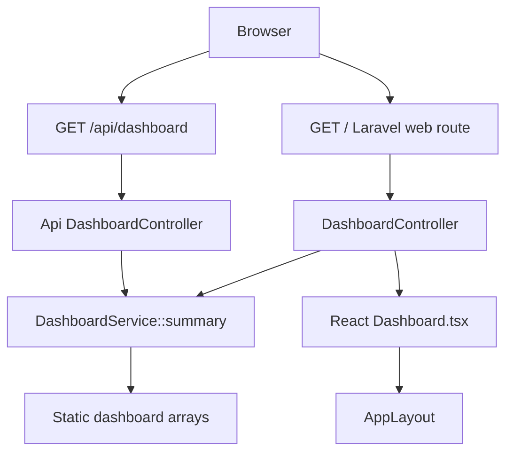

# Code Analysis Report

## Detected Stack

| Area | Detection | Confidence | Evidence |
|---|---|---:|---|
| Languages | PHP 8.4, TypeScript/TSX, JavaScript | High | `backend/composer.json` requires `php: ^8.4`; dashboard UI is `frontend/resources/js/Pages/Dashboard.tsx`; Vite config is JavaScript. |
| Backend framework | Laravel 12 with Inertia Laravel | High | `backend/composer.json` requires `laravel/framework: ^12` and `inertiajs/inertia-laravel: ^2.0`; routes use Laravel `Route`; controllers return Inertia and JSON responses. |
| Frontend framework | React 19, Inertia React, Vite, Tailwind utility classes | High | `frontend/package.json` includes `react`, `react-dom`, `@inertiajs/react`, `vite`, `laravel-vite-plugin`; TSX components render dashboard and layout. |
| Data layer | Laravel database config exists; dashboard summary currently uses static in-memory arrays | High | `backend/config/database.php` defines SQLite/MySQL/MariaDB/Postgres/SQL Server/Redis options; `DashboardService::summary()` returns hard-coded arrays and performs no DB calls. |
| Build/deploy | Composer, pnpm/npm scripts, Vite SSR build | High | Composer scripts include Laravel dev server and queue listener; frontend scripts include `vite build && vite build --ssr`, lint, format. |
| Testing | Pest + Pest Laravel for backend feature tests; ESLint/Prettier for frontend quality | High | `backend/composer.json` requires Pest packages; `backend/tests/Feature/DashboardApiTest.php` covers API and Inertia page; `frontend/package.json` has lint/format scripts. |
| Runtime/deployment | Laravel app bootstrap with web/api routing and health endpoint | Medium | `backend/bootstrap/app.php` wires `routes/web.php`, `routes/api.php`, and `/up`; no Docker/CI files were opened in this analysis. |

### Per-File Roles

| File | Role | Notes |
|---|---|---|
| `backend/routes/web.php` | Web route definition | `GET /` maps to Inertia dashboard; `/dashboard` redirects to `/`. |
| `backend/routes/api.php` | API route definition | `GET /api/dashboard` maps to API dashboard controller. |
| `backend/app/Http/Controllers/DashboardController.php` | Inertia controller | Injects `DashboardService` and renders `Dashboard` with summary props. |
| `backend/app/Http/Controllers/Api/DashboardController.php` | JSON API controller | Injects `DashboardService` and wraps summary in `{ success, data, meta }`. |
| `backend/app/Services/DashboardService.php` | Business/read-model service | Provides static dashboard stats, activity, breakdown, and region arrays. |
| `frontend/resources/js/Pages/Dashboard.tsx` | React page/component | Renders stats, Recent Activity table, status breakdown, and region cards from Inertia props. |
| `frontend/resources/js/layouts/AppLayout.tsx` | React layout/navigation | Provides sidebar, mobile menu state, and content shell. |
| `frontend/resources/js/app.tsx` | Frontend entry point | Boots Inertia React and SSR/client render mode. |
| `frontend/vite.config.js` | Build/dev config | Connects frontend build to Laravel public assets and redirects Vite root to Laravel app URL. |
| `backend/tests/Feature/DashboardApiTest.php` | Feature tests | Verifies JSON shape/counts and Inertia page props. |

## Architectural Context

The observed architecture is a small layered Laravel/Inertia application. Routes define inbound web/API surfaces, controllers delegate to a shared `DashboardService`, the service returns the dashboard read model, and React/Inertia components render the UI. Presentation and backend read-model construction are mostly separated: the React page does not call the API directly, while both API and Inertia controllers reuse the same service.

The requested enhancement, "Add filter controls above Recent Activity in dashabord", is localized primarily to `frontend/resources/js/Pages/Dashboard.tsx`. If filters are purely client-side over the existing activity array, no backend route or service contract change is required. If filter choices must be persisted, shared via URL, or sourced from live data, the service/API contract would need explicit filter parameters and validation.

### Dependencies & Boundaries

| Component | Internal dependencies | External dependencies | Boundary notes |
|---|---|---|---|
| Web controller | `App\Services\DashboardService` | `Inertia\Inertia`, `Inertia\Response` | Inertia contract exposes `stats`, `activity`, `breakdown`, `regions` as page props. |
| API controller | `App\Services\DashboardService` | `Illuminate\Http\JsonResponse`, Laravel `response()` helper | JSON contract wraps service data in `success`, `data`, and `meta`. |
| Dashboard service | None observed | None observed | Static read model; no persistence boundary yet. |
| Dashboard React page | `@/layouts/AppLayout` | `@inertiajs/react`, `lucide-react` | UI assumes incoming props match local TypeScript aliases. |
| Layout | `@/lib/utils` | `@inertiajs/react`, React `useState`, `lucide-react` | Maintains only mobile sidebar UI state. |

No circular dependencies were observed in the opened files.

## Data & State Structures

### Persistent Data

No persistent dashboard records are read or written by the analyzed dashboard path. `backend/config/database.php` defines database and Redis connections, but `DashboardService::summary()` returns static arrays. Existing migrations cover framework infrastructure such as sessions, cache, and jobs based on the repository blueprint, not dashboard domain records.

### In-Memory / Transient Structures

| Structure | Location | Lifecycle | Fields |
|---|---|---|---|
| Dashboard summary array | `DashboardService::summary()` | Created per request | `stats`, `activity`, `breakdown`, `regions`. |
| `DashboardProps` | `Dashboard.tsx` | Type-only React props | Mirrors the service summary arrays. |
| `Status` union | `Dashboard.tsx` | Type-only | `active`, `paused`, `failed`. |
| `icons` map | `Dashboard.tsx` | Module constant | Maps stat keys to Lucide icon components. |
| `badgeClass` map | `Dashboard.tsx` | Module constant | Maps known statuses to CSS classes. |
| `nav` array | `AppLayout.tsx` | Module constant | Static navigation entries. |
| `open` state | `AppLayout.tsx` | Component state | Controls mobile sidebar visibility. |

### State Management

The dashboard page currently has no local filter state and no global store. Adding filter controls above Recent Activity will likely introduce component-local state for status/module/region/search filters, unless URL-backed filters are required.

## Inputs, Parameters & Contracts

### Inputs & Fields Report
#### Unit: `GET /` Inertia Dashboard  (File: `backend/routes/web.php`, `backend/app/Http/Controllers/DashboardController.php`)

| # | Name | Scope | Direction/Role | Data Type | Nature | Default | Array? |
|---|---|---|---|---|---|---|---|
| 1 | route path `/` | Route | INPUT | string path | Mandatory | `/` | No |
| 2 | `DashboardService $dashboard` | Constructor dependency | INPUT | service object | Mandatory | Container injected | No |
| 3 | `stats` | Inertia prop | OUTPUT | list<object> | Output | From `summary()` | Yes |
| 4 | `activity` | Inertia prop | OUTPUT | list<object> | Output | From `summary()` | Yes |
| 5 | `breakdown` | Inertia prop | OUTPUT | list<object> | Output | From `summary()` | Yes |
| 6 | `regions` | Inertia prop | OUTPUT | list<object> | Output | From `summary()` | Yes |

Contract: HTTP `GET /`, renders Inertia component `Dashboard`, status normally 200. No explicit auth requirement was observed on the route.

### Inputs & Fields Report
#### Unit: `GET /api/dashboard` JSON API  (File: `backend/routes/api.php`, `backend/app/Http/Controllers/Api/DashboardController.php`)

| # | Name | Scope | Direction/Role | Data Type | Nature | Default | Array? |
|---|---|---|---|---|---|---|---|
| 1 | route path `/api/dashboard` | Route | INPUT | string path | Mandatory | `/api/dashboard` | No |
| 2 | `DashboardService $dashboard` | Constructor dependency | INPUT | service object | Mandatory | Container injected | No |
| 3 | `success` | JSON response | OUTPUT | boolean | Output | `true` | No |
| 4 | `data` | JSON response | OUTPUT | object | Output | `summary()` | No |
| 5 | `meta.generated_at` | JSON response | OUTPUT | ISO8601 string | Derived/Computed | `now()->toIso8601String()` | No |
| 6 | `meta.source` | JSON response | OUTPUT | string | Mandatory with Default | `php-api` | No |

Contract: HTTP `GET /api/dashboard`, response body `application/json`, status normally 200, no request body/query/path parameters observed, no explicit auth requirement observed.

### Inputs & Fields Report
#### Unit: `DashboardService::summary()`  (File: `backend/app/Services/DashboardService.php`)

| # | Name | Scope | Direction/Role | Data Type | Nature | Default | Array? |
|---|---|---|---|---|---|---|---|
| 1 | `stats[].key` | Return item | OUTPUT | string | Enumerated | static literals | Yes |
| 2 | `stats[].label` | Return item | OUTPUT | string | Output | static literals | Yes |
| 3 | `stats[].value` | Return item | OUTPUT | string | Output | static literals | Yes |
| 4 | `stats[].hint` | Return item | OUTPUT | string | Output | static literals | Yes |
| 5 | `activity[].name` | Return item | OUTPUT | string | Output | static literals | Yes |
| 6 | `activity[].phone` | Return item | OUTPUT | string | Output | static literals | Yes |
| 7 | `activity[].module` | Return item | OUTPUT | string | Enumerated | static literals | Yes |
| 8 | `activity[].status` | Return item | OUTPUT | string | Enumerated | static literals | Yes |
| 9 | `activity[].region` | Return item | OUTPUT | string | Output | static literals | Yes |
| 10 | `activity[].updated` | Return item | OUTPUT | string | Output | static literals | Yes |
| 11 | `breakdown[].label` | Return item | OUTPUT | string | Enumerated | static literals | Yes |
| 12 | `breakdown[].count` | Return item | OUTPUT | int | Output | static literals | Yes |
| 13 | `breakdown[].percent` | Return item | OUTPUT | int | Output | static literals | Yes |
| 14 | `breakdown[].color` | Return item | OUTPUT | string hex color | Output | static literals | Yes |
| 15 | `regions[].region` | Return item | OUTPUT | string | Output | static literals | Yes |
| 16 | `regions[].records` | Return item | OUTPUT | int | Output | static literals | Yes |

### Inputs & Fields Report
#### Unit: `Dashboard` React component  (File: `frontend/resources/js/Pages/Dashboard.tsx`)

| # | Name | Scope | Direction/Role | Data Type | Nature | Default | Array? |
|---|---|---|---|---|---|---|---|
| 1 | `stats` | Prop | INPUT | `{ key, label, value, hint }[]` | Mandatory | None | Yes |
| 2 | `activity` | Prop | INPUT | activity row array | Mandatory | None | Yes |
| 3 | `breakdown` | Prop | INPUT | breakdown row array | Mandatory | None | Yes |
| 4 | `regions` | Prop | INPUT | region row array | Mandatory | None | Yes |
| 5 | `row.status` | Rendered row field | INPUT | `Status` union | Enumerated | None | No |
| 6 | `stat.key` | Rendered stat field | INPUT | string | Optional fallback | `Database` icon fallback | No |

### Inputs & Fields Report
#### Unit: `AppLayout` React component  (File: `frontend/resources/js/layouts/AppLayout.tsx`)

| # | Name | Scope | Direction/Role | Data Type | Nature | Default | Array? |
|---|---|---|---|---|---|---|---|
| 1 | `children` | Prop | INPUT | `React.ReactNode` | Mandatory | None | No |
| 2 | `open` | Component state | Input-Output | boolean | Mandatory with Default | `false` | No |
| 3 | `onNavigate` | Sidebar prop | INPUT | `() => void` | Optional | None | No |

## Validation Logic

The analyzed dashboard has minimal explicit runtime validation because it accepts no user-supplied body/query parameters and uses static service data. TypeScript and PHPDoc provide static contracts, but backend runtime shape validation for service return data is absent.

### Validations for `row.status`
- **Category:** Enumeration / allowed values
  - **Location:** `frontend/resources/js/Pages/Dashboard.tsx`, type alias `Status`
  - **Code:** `type Status = 'active' | 'paused' | 'failed';`
  - **Triggered:** Static TypeScript compile-time only
  - **Effect:** Compile-time restriction for TS-authored values; does not protect runtime data from Laravel.
- **Category:** Enumeration / style mapping
  - **Location:** `frontend/resources/js/Pages/Dashboard.tsx`, `badgeClass`
  - **Code:** `const badgeClass: Record<Status, string> = { active: ..., failed: ..., paused: ... }`
  - **Triggered:** On render for every activity row
  - **Effect:** Maps known statuses to CSS. Unknown runtime status produces `undefined` class without a visible fallback.

### Validations for `stat.key`
- **Category:** Default substitution
  - **Location:** `frontend/resources/js/Pages/Dashboard.tsx`, stats render map
  - **Code:** `const Icon = icons[stat.key] ?? Database;`
  - **Triggered:** When a stat key is not present in the icon map
  - **Effect:** Falls back to `Database` icon; render continues.

### Validations for route methods
- **Category:** HTTP method constraint
  - **Location:** `backend/routes/web.php` and `backend/routes/api.php`
  - **Code:** `Route::get('/', DashboardController::class)` and `Route::get('/dashboard', DashboardController::class)`
  - **Triggered:** Always at routing layer
  - **Effect:** Only GET requests match these dashboard handlers.

### Conditional Dependencies

| Field | Required When | Condition |
|---|---|---|
| Future filter value `status` | Conditional Mandatory | Only if a status filter control is active and backend/API filtering is added. |
| Future filter value `module` | Conditional Mandatory | Only if a module filter control is active and backend/API filtering is added. |
| Future filter value `region` | Conditional Mandatory | Only if a region filter control is active and backend/API filtering is added. |

## Performance & Stability

| Finding | Severity | Evidence | Impact |
|---|---|---|---|
| No current data-access performance risk in dashboard path | Info | `DashboardService::summary()` returns static arrays with 10 activity rows and no queries. | Runtime cost is bounded and small. |
| Potential React key collision for activity rows | Low | `Dashboard.tsx` uses `key={row.name}` for activity rows. | Duplicate names would cause unstable row reconciliation if real data replaces static rows. |
| Future client-side filters should memoize only if data grows large | Info | Current activity size is 10 rows; no heavy computation exists. | Simple derived filtering is acceptable now; server-side pagination may be needed for live large datasets. |
| API metadata timestamp makes exact snapshot comparisons brittle | Low | API returns `meta.generated_at = now()->toIso8601String()`. | Tests should assert presence/format rather than fixed values, which current test already does structurally. |

## Security

| Finding | Severity | Evidence | Impact |
|---|---|---|---|
| Dashboard API is public unless protected elsewhere | Medium | `routes/api.php` registers `GET /dashboard` without observed auth middleware; `routes/web.php` registers `GET /` without observed auth middleware. | If dashboard records become sensitive, unauthenticated access may expose operational data. |
| No injection surface observed in current dashboard path | Info | No request parameters are accepted; no SQL/command construction is present. | Current static-data implementation avoids injection risk. |
| Runtime validation absent for future filters | Medium | No filter parameters exist yet; adding filters to API/query handling would introduce user input. | Future backend filtering must validate allow-listed `status`, `module`, `region`, and search limits. |
| No hard-coded secrets observed in opened files | Info | Opened service, routes, controllers, Vite config, and manifests contain no credentials. | Config values are environment-based in `database.php`. |

## Integration & Connectivity

| Integration | Direction | Contract | Coupling Risk |
|---|---|---|---|
| Browser to Laravel web route | Inbound | `GET /` renders Inertia `Dashboard` props | React prop type and PHP service PHPDoc must stay aligned manually. |
| Browser/API clients to Laravel API route | Inbound | `GET /api/dashboard` returns `{ success, data, meta }` | No versioning; consumers depend on current JSON shape. |
| Laravel to Inertia React | Internal full-stack boundary | `Inertia::render('Dashboard', $this->dashboard->summary())` | Missing runtime schema validation between PHP arrays and TS props. |
| Vite dev server to Laravel app | Development-time | Vite root redirects to backend `APP_URL`; Laravel Vite plugin writes to public build paths | Local development depends on backend `.env` and relative backend/frontend paths. |
| Database/Redis config | Potential infrastructure | Env-driven DB and Redis connections | Not used by dashboard summary today. |

## Readability, Maintainability & Code Smells

The dashboard code is readable and intentionally compact. The strongest maintainability concern is the duplicated, manually synchronized data shape: PHPDoc in `DashboardService`, JSON test structure, and TypeScript `DashboardProps` all define the same contract separately. The current static service is appropriate for demo data but will become a god object/read-model dumping ground if live filtering, persistence, and aggregation logic are added without repositories or query objects.

Specific observations:

| Smell / Quality Point | Severity | Evidence | Recommendation |
|---|---|---|---|
| Static demo data embedded in service | Low | `DashboardService::summary()` hard-codes all stats/activity/breakdown/region rows. | Acceptable for demo; move to persistence/query layer when records become real. |
| Dashboard component has no subcomponents for large sections | Low | `Dashboard.tsx` renders header, stat cards, activity table, breakdown, and regions in one component. | Extract `ActivityFilters`/`ActivityTable` when adding filter controls. |
| Typo in user request scope | Info | Request says "dashabord"; code component is `Dashboard`. | Use existing code spelling in implementation. |
| Public nav links are placeholders | Low | `AppLayout.tsx` maps all nav entries to `/`. | Update when routes exist; not required for filter controls. |

## Field-Level Analysis

### Counts

| Metric | Count | Notes |
|---|---:|---|
| Total fields/parameters identified | 42 | Includes route paths, service dependency inputs, response fields, service row fields, React props/state, and key rendered row fields. |
| Mandatory fields | 9 | Route paths, injected services, required React props/state/children. |
| Optional fields | 2 | `Sidebar.onNavigate`; `stat.key` has fallback for icon lookup. |
| Default/pre-defaulted fields | 4 | `success=true`, `meta.source='php-api'`, `open=false`, fallback icon for unknown stat key. |
| Output/derived fields | 27 | Service summary arrays, API metadata, rendered props. |

### Validation Classification

| Classification | Fields | Observed validation |
|---|---|---|
| Input validation | Route methods; `row.status` static TypeScript union | Laravel route method matching; TS compile-time union only. |
| Business validation | None observed | Static demo data has no business rule checks. |
| Database validation | None observed for dashboard domain | No dashboard DB tables or queries in analyzed path. |
| Conditional validation | None currently | Future filters may require conditional handling if a filter is active. |

### Gaps Relevant to Filter Enhancement

| Gap | Severity | Recommendation |
|---|---|---|
| No canonical filter vocabulary is exported from backend | Medium | Derive UI filter options from existing `activity` data for client-side filters, or add a backend `filters` contract if API filtering is required. |
| No runtime guard for unknown statuses | Low | Add a display fallback for unknown `row.status` if data becomes dynamic. |
| No URL/query contract for filters | Low | Keep client-local state for a simple dashboard control; use URL params only if filters must be shareable/bookmarkable. |
| No test for UI filtering | Medium | Add frontend component tests if a frontend test runner exists; otherwise add backend tests only if backend filtering is introduced. |

## Prioritized Findings

| Rank | Severity | Finding / Recommendation | Impact | Effort |
|---:|---|---|---|---|
| 1 | Medium | Dashboard routes are public in observed routing; add auth middleware before real/sensitive dashboard data is exposed. | Prevents accidental exposure of operational IVR data. | Medium |
| 2 | Medium | Future filter query parameters need allow-list validation for status/module/region/search if implemented server-side. | Avoids invalid states and future injection/DoS risks as filtering becomes dynamic. | Low |
| 3 | Medium | Add filter controls as client-local state unless persistence/shareable URLs are required. | Satisfies requested UI change without expanding backend contract. | Low |
| 4 | Low | Replace `key={row.name}` with a stable unique identifier once real activity data exists. | Prevents React reconciliation issues for duplicate names. | Low |
| 5 | Low | Extract activity filter/table subcomponents when adding controls. | Keeps `Dashboard.tsx` maintainable as UI grows. | Low |
| 6 | Low | Align PHPDoc, JSON tests, and TS props through shared schema or stricter tests if dashboard contract evolves. | Reduces drift across PHP and TypeScript boundaries. | Medium |

## Summary for Agentic Memory

This repository is a Laravel 12 plus Inertia React 19 application with PHP backend code under `backend/` and TypeScript/TSX frontend code under `frontend/`. The dashboard surface is served by `GET /` through an Inertia controller and by `GET /api/dashboard` through a JSON controller, both sharing `DashboardService::summary()`. The summary data is currently static in-memory PHP arrays, with no dashboard database access or user input parameters in the observed path. The React dashboard renders stats, Recent Activity, status breakdown, and top regions from required Inertia props, and currently has no local filter state. The requested filter controls above Recent Activity should be implemented primarily in `frontend/resources/js/Pages/Dashboard.tsx` as client-side derived filtering unless the product requires URL-backed or API-backed filtering.

Branch name: `analysis/20260721T231401-dashboard-filters`
Files pushed: `agent-runs/20260721T231401_ic7jyw/01-code-analysis.md`, `agent-runs/20260721T231401_ic7jyw/analysis_output.json`
PR Agent will open the pull request.
