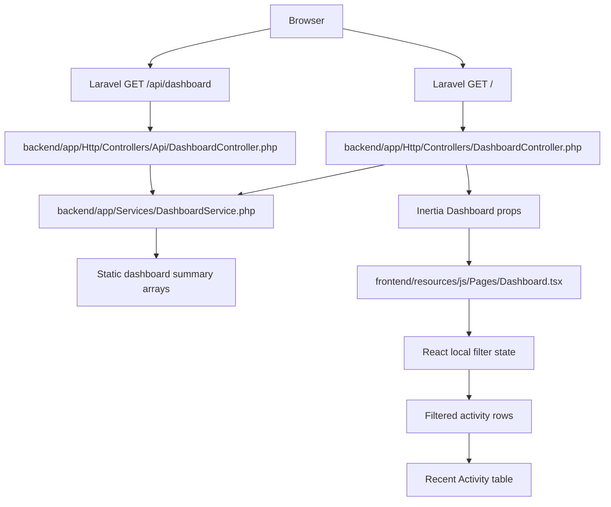
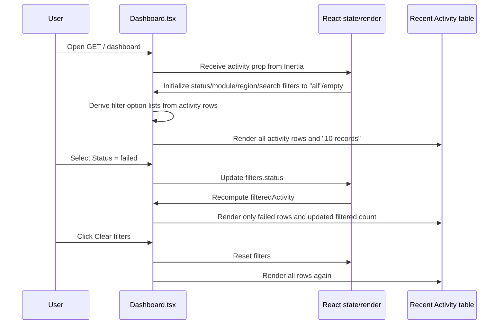
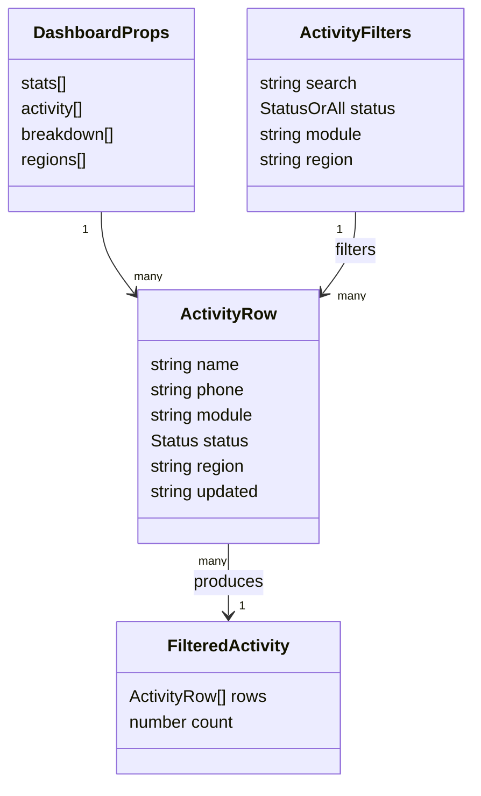

# Design Document: Dashboard Recent Activity Filters

## I. Executive Summary

| Item | Decision |
|---|---|
| Problem | Add filter controls above the Recent Activity table on the dashboard so users can narrow visible activity records without leaving the page. |
| Audience | Dashboard users monitoring IVR regression tests and discovery scans; downstream Code Gen, Test Gen, and Jira Spec Creator agents. |
| Success criteria | Filter controls appear directly above Recent Activity; users can filter by status, module, region, and free-text search; filtered record count updates; clearing filters restores all 10 current rows; existing Laravel/Inertia API contracts remain unchanged. |
| Detected stack | Laravel 12 + Inertia Laravel 2 backend, React 19 + Inertia React 2 + TypeScript/TSX + Vite 7 frontend, Tailwind utility styling, Pest Laravel backend tests, ESLint/Prettier frontend quality tooling. |
| Stack confidence | High, based on `analysis_output.json`, `backend/composer.json`, `frontend/package.json`, `DashboardService.php`, and `Dashboard.tsx`. |
| In scope | Frontend-local filtering in `frontend/resources/js/Pages/Dashboard.tsx`; derived filter option lists from existing `activity` props; empty-state row; stable filtered count; lint/build verification. |
| Out of scope | New backend query parameters, API filtering, database migrations, authentication changes, route changes, persistent/shareable filter URLs, new test framework installation. |
| Rejected alternative | Server-side/API-backed filtering was rejected for this enhancement because current dashboard data is static, bounded, and already delivered to the Inertia page; adding API contracts now would expand blast radius without a stated requirement. |

## II. System Architecture

### Component / Data-Flow Diagram

### Component Breakdown

| Component | Stack term | Responsibility | Change required |
|---|---|---|---|
| `backend/routes/web.php` | Laravel web route | Serves `GET /` Inertia page. | No change. |
| `backend/routes/api.php` | Laravel API route | Serves `GET /api/dashboard` JSON summary. | No change. |
| `backend/app/Services/DashboardService.php` | Laravel service/read model | Returns static dashboard summary data. | No change for this client-side design. |
| `frontend/resources/js/Pages/Dashboard.tsx` | React/Inertia page component | Renders page header, stat cards, Recent Activity table, status breakdown, and regions. | Add local filter state, derived options, derived filtered rows, controls above table, empty state. |
| `frontend/package.json` | Frontend scripts | Provides `lint`, `format:check`, `build`. | No change; commands used for verification. |

### Primary Flow: Inertia Page With Client-Side Filtering

### Cross-Cutting Concerns

| Concern | Design |
|---|---|
| Logging | Not applicable — filter interactions are local UI state and do not call backend services. |
| Errors | No network errors introduced. UI handles no-match state with an empty table message instead of rendering a blank body. |
| Config | Not applicable — no environment or runtime config needed. |
| Accessibility | Use associated labels or `aria-label` for search/select controls; use real `button`, `input`, and `select` elements. |
| Styling | Reuse existing Tailwind utility classes, `bg-card`, `border`, `text-muted-foreground`, and button/select sizing patterns already in `Dashboard.tsx`. |
| Performance | Use simple derived arrays. Current dataset is 10 rows; `useMemo` is optional but recommended to keep derived option/filter computation explicit. |
| Compatibility | Preserve existing Inertia props and API response shape. No source-compatible backend changes required. |

## III. Data Model

### Entities / Schemas

No persistent data model changes are required. The enhancement operates on existing transient `activity` rows passed into `Dashboard.tsx`.

| Entity | Field | Type | Mandatory | Optional | Default | Validation / Rule |
|---|---|---|---:|---:|---|---|
| Activity row | `name` | string | Yes | No | None | Included in free-text search; currently used as React key but should be combined with `phone` for stability. |
| Activity row | `phone` | string | Yes | No | None | Included in free-text search. |
| Activity row | `module` | string | Yes | No | None | Filter option; values derived from distinct activity rows, e.g. `Regression Tests`, `Discovery Scans`. |
| Activity row | `status` | `active` \| `paused` \| `failed` | Yes | No | None | Filter option; allowed by TypeScript union and `badgeClass`. |
| Activity row | `region` | string | Yes | No | None | Filter option; values derived from distinct activity rows, e.g. `US`, `GB`, `SG`. |
| Activity row | `updated` | string | Yes | No | None | Display only; not filterable in this design. |
| Filter state | `search` | string | Yes | No | `''` | Trim and case-normalize for matching against `name`, `phone`, `module`, `region`, and `status`. |
| Filter state | `status` | `Status` or `all` | Yes | No | `all` | Match exact row status when not `all`. |
| Filter state | `module` | string or `all` | Yes | No | `all` | Match exact row module when not `all`; options derived from activity. |
| Filter state | `region` | string or `all` | Yes | No | `all` | Match exact row region when not `all`; options derived from activity. |

### Relationships

### Storage / Migration Notes

Not applicable — no database table, migration, cache key, session state, or persistent model is introduced.

## IV. API / Interface Design

### Backend API Contracts

| Contract | Current behavior | Change |
|---|---|---|
| `GET /` | Renders Inertia `Dashboard` with `stats`, `activity`, `breakdown`, `regions`. | No change. |
| `GET /api/dashboard` | Returns `{ success, data: { stats, activity, breakdown, regions }, meta }`. | No change. |

### Frontend UI Contract

| Control | Type | Options / Behavior | Initial value | Acceptance rule |
|---|---|---|---|---|
| Search | Text input | Filters rows when query appears in `name`, `phone`, `module`, `region`, or `status`, case-insensitive. | Empty string | Empty search does not exclude any rows. |
| Status | Select | `All statuses`, plus `active`, `paused`, `failed` options present in current activity. | `all` | Non-all value requires exact row status match. |
| Module | Select | `All modules`, plus distinct modules from activity sorted by first appearance or alphabetically. | `all` | Non-all value requires exact row module match. |
| Region | Select | `All regions`, plus distinct regions from activity. | `all` | Non-all value requires exact row region match. |
| Clear filters | Button | Resets all filters to defaults; disabled or visually neutral when no active filters. | N/A | After click, all current activity rows render. |
| Count badge | Text badge | Shows filtered count and total count, e.g. `2 of 10 records`, when filters are active; `10 records` when not active. | Total count | Count always reflects rows currently rendered. |
| Empty state | Table row | Displays a single row spanning all columns when no rows match. | Hidden | Message includes a clear action or instruction to adjust filters. |

### Error Design

No new HTTP errors are introduced. The UI handles a valid zero-result state. Unknown runtime statuses should continue rendering text; a fallback badge class may be added if Code Gen chooses to harden the row rendering.

### Auth Design

No new auth surface is introduced. Existing public route risk remains documented but is out of scope for this dashboard-only client filter change.

### Example UI Behavior

| User action | Expected visible result |
|---|---|
| Select `Status = failed` | Recent Activity shows `DE Support Line Regression` and `AU Telco Regression Pack`; count shows `2 of 10 records`. |
| Select `Module = Discovery Scans` and `Region = JP` | Recent Activity shows `JP Customer Care Scan`; count shows `1 of 10 records`. |
| Search `banking` | Recent Activity shows `APAC Banking Path Map`. |
| Search `zzz` | Table shows empty-state row and count `0 of 10 records`. |

## V. Business Logic & Validation Design

### Core Rules

| Rule ID | Rule | Location |
|---|---|---|
| BL-01 | Filtering is client-side only over the already loaded `activity` prop. | `Dashboard.tsx` |
| BL-02 | Each filter is optional; inactive filters do not exclude rows. | `Dashboard.tsx` |
| BL-03 | Active status/module/region filters are combined with AND semantics. | `Dashboard.tsx` |
| BL-04 | Search is case-insensitive and matches across `name`, `phone`, `module`, `region`, and `status`. | `Dashboard.tsx` |
| BL-05 | Filter option lists are derived from `activity`, avoiding hard-coded module/region drift. | `Dashboard.tsx` |
| BL-06 | Count badge reflects `filteredActivity.length`; total remains `activity.length`. | `Dashboard.tsx` |
| BL-07 | Empty-state row renders when `filteredActivity.length === 0`. | `Dashboard.tsx` |
| BL-08 | Reset action restores `search=''`, `status='all'`, `module='all'`, and `region='all'`. | `Dashboard.tsx` |

### Validation Matrix

| Input / Field | Input validation | Business validation | Database validation | Conditional validation |
|---|---|---|---|---|
| `search` | String from text input; trim/lowercase for comparisons. | Empty search is inactive; non-empty search must match at least one searchable row field to include row. | Not applicable. | Apply only when trimmed value is non-empty. |
| `status` | Select values generated from `activity[].status` plus `all`; TypeScript union for known statuses. | Exact match when not `all`. | Not applicable. | Apply only when value is not `all`. |
| `module` | Select values generated from `activity[].module` plus `all`. | Exact match when not `all`. | Not applicable. | Apply only when value is not `all`. |
| `region` | Select values generated from `activity[].region` plus `all`. | Exact match when not `all`. | Not applicable. | Apply only when value is not `all`. |
| `activity` prop | Existing `DashboardProps` type. | Must be treated as source of truth for options and rows. | Not applicable. | Empty activity array should render controls and empty state without crashing. |
| `row.status` badge | Existing `badgeClass` map. | Unknown runtime values should not break render; optional fallback class recommended. | Not applicable. | Fallback only needed if row status is outside known map at runtime. |

## VI. Infrastructure & DevOps

| Area | Design |
|---|---|
| Deploy target | Existing Laravel/Inertia application deployment. No infrastructure changes. |
| CI/CD | Existing frontend lint/build and backend Pest tests should be used. No new CI files are required. |
| Secrets | Not applicable — no secrets or environment variables introduced. |
| Observability | Not applicable for local UI state. No metrics/logs required. |
| Build commands | From `frontend/`: `npm run lint`, `npm run format:check`, `npm run build` or equivalent package manager command in repository setup. |
| Backend verification | From `backend/`: run Pest feature tests if standard dependencies are available, especially `DashboardApiTest.php`, to confirm backend contract remains unchanged. |
| Rollback | Revert the frontend component change; no data rollback or migration rollback required. |

## VII. Security & Compliance

| Concern | Finding | Design response |
|---|---|---|
| AuthN/AuthZ | Analysis found dashboard web/API routes public in observed definitions. | No additional exposure is introduced because filtering is local and uses already delivered data. Auth hardening remains a separate task before live sensitive data. |
| Data protection | Activity rows include operational IVR names and phone numbers already visible in dashboard. | No new transmission, persistence, logging, or export of this data. |
| Input handling | Search/select input is local only. | No SQL, command, or API query is generated; injection risk does not increase. |
| XSS | React escapes rendered string values by default. | Continue rendering values as text, not via `dangerouslySetInnerHTML`. |
| Compliance | No regulated data workflow identified in analysis. | Not applicable — reason: enhancement does not add storage, identity, audit, or external data transfer. |

## VIII. Enhancement / Implementation Strategy

### Impact / Blast Radius

| Area | Impact |
|---|---|
| Frontend | Moderate localized edit to `Dashboard.tsx`. |
| Backend | None. |
| API clients | None; `GET /api/dashboard` unchanged. |
| Data storage | None. |
| Tests/quality | Frontend lint/build verification required; backend feature tests optional regression check. |

### Ordered Minimal Delivery Steps

1. Introduce explicit `ActivityRow` and filter state types in `Dashboard.tsx` to make derived filtering readable.
2. Add React `useMemo` and `useState` imports.
3. Derive distinct status/module/region filter options from `activity`.
4. Implement `filteredActivity` with AND semantics and case-insensitive search.
5. Add filter control bar directly between the Recent Activity section header and the table.
6. Update count badge to display filtered count versus total when filters are active.
7. Render `filteredActivity` instead of `activity` in the table; use a more stable composite key such as `${row.name}-${row.phone}`.
8. Add empty-state table row and clear filters action.
9. Run frontend lint/format/build checks and backend regression tests where available.

## IX. Traceability

| Design decision | Analysis section / key / requirement |
|---|---|
| Implement filters in `Dashboard.tsx` only | User requirement: "Add filter controls above Recent Activity in dashabord"; analysis recommendation: client-local filtering unless shareable URL/API-backed filters required. |
| Preserve backend/API contracts | `analysis_output.json.integration_points`; `GET /` and `GET /api/dashboard` currently share `DashboardService::summary()`. |
| Derive filter options from activity rows | `analysis_output.json.recommendations[0-1]`; gap: no canonical backend filter vocabulary. |
| Include status/module/region/search filters | Analysis field report: `activity[].status`, `activity[].module`, `activity[].region`, `activity[].name`, `activity[].phone`. |
| Add allow-list behavior via select options | `validation_classifications.input`; future filter values should be allow-listed if server-side. Client selects are derived from known rows. |
| Add empty state and updated count | Success criteria for usable filtered UI; closes UX gap created by filtering. |
| Do not add migration/data layer | Analysis: dashboard summary uses static in-memory arrays and no DB calls. |
| Run frontend lint/build | `frontend/package.json` scripts; React/TypeScript/Vite stack. |
| Optional backend regression test | `backend/tests/Feature/DashboardApiTest.php` already covers unchanged dashboard contracts. |
| Track public dashboard auth as out of scope | `analysis_output.json.security_findings`: public routes are a medium finding but not required for local filter controls. |

## X. Open Questions & Risks

| Item | Type | Assumption / Risk | Mitigation | Owner |
|---|---|---|---|---|
| URL persistence | Open question | Filters are not required to be bookmarkable/shareable. | Keep local state for this delivery; create a follow-up if product asks for URL state. | Product owner |
| Server-side filtering | Open question | Dataset remains small enough to filter client-side. | Move filtering into API/query layer only when data becomes large or paginated. | Engineering lead |
| Frontend test runner | Risk | Repository currently exposes lint/build scripts but no observed React component test runner. | Verify with lint/build; do not add new testing framework for this small UI change unless team standard requires it. | Code Gen/Test Gen |
| Public dashboard routes | Risk | Routes are public in analysis; live data may become sensitive. | Separate security hardening task before replacing demo data with real data. | Engineering lead/security |
| Runtime status drift | Risk | PHP service status strings and TS `Status` union can drift. | Derive options from current rows and consider fallback badge class; add stronger contract tests if API evolves. | Code Gen |
