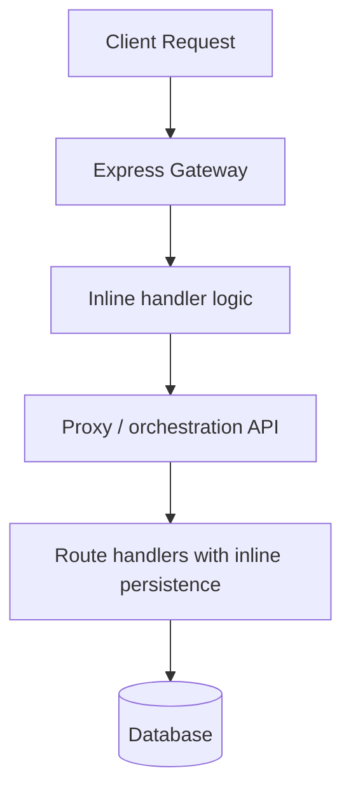
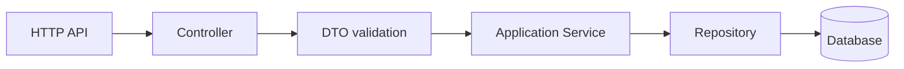
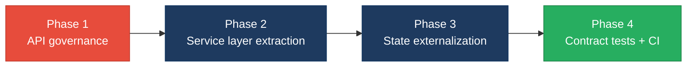

# 4. Backend Modernization Hotspots Analysis

**Objective:** Modernize backend architecture and coding practices; strengthen API & integration governance.

**Date:** 2026-07-20 | **Scope:** `.` — Node.js 20.x / Express 5-style service mesh with CommonJS backend services, Mongoose-based persistence, and an Express API gateway

## Executive Summary

> **Executive Summary**
>
> The backend stack is a Node/Express ecosystem split across a client gateway, a client integrations API, a vendor orchestration API, and a vendor license service. The most important modernization gap is architectural rather than syntactic: request handlers and route modules still carry orchestration, persistence, and auth concerns inline, while the orchestration service relies on mutable in-memory job state for production workflow coordination. API governance is present in the sense that the system exposes multiple HTTP surfaces, but there is no observed OpenAPI/spec linting or contract-test discipline in the scanned backend services. Overall health is Moderate: the code is organized into services, but the persistence boundary and lifecycle boundary are still leaky enough to create operational risk and make future changes harder than they should be.

<div class="metric-grid">
<div class="metric-card"><div class="metric-number">9</div><div class="metric-label">Controllers / Handlers Scanned</div></div>
<div class="metric-card"><div class="metric-number">0</div><div class="metric-label">Files Using Dynamic-Variable Patterns</div></div>
<div class="metric-card"><div class="metric-number">0</div><div class="metric-label">Service Classes Found</div></div>
<div class="metric-card"><div class="metric-number">12</div><div class="metric-label">API Endpoints Found</div></div>
</div>

<div class="overall-rating overall-rating--moderate"><div class="overall-rating-label">Overall Codebase Rating — Backend Modernization</div><div class="overall-rating-value">Moderate</div><div class="overall-rating-note">The verdict is driven by inline persistence/business logic in route handlers, the in-memory job store, and missing API governance across exposed services.</div></div>

## 4.1 Benchmark Ratings Summary

One row per hotspot. "Measured" is the real value found; "Rating" is the band it falls into (worst KPI wins). This table is the source for the Overall Codebase Rating banner above.

| # | Hotspot | Primary KPI | <span class="rating rating-good">Good</span> | <span class="rating rating-moderate">Moderate</span> | <span class="rating rating-high-risk">High Risk</span> | Measured | Rating |
|---|---|---|---|---|---|---|---|
| H1 | Dynamic Variable Creation | Dynamic-var-from-input occurrences | 0 | 1–10 | >10 | 0 observed | <span class="rating rating-good">Good</span> |
| H2 | Global Mutable State | Globals / mutable static state | 0 | 1–5 | >5 | 1 mutable in-memory job store | <span class="rating rating-moderate">Moderate</span> |
| H3 | Direct SQL Outside Data Layer | Data-layer compliance % | >90% | 60–90% | <60% | 4 route files issue ORM calls inline | <span class="rating rating-moderate">Moderate</span> |
| H4 | Static / Singleton Abuse | Business-logic static/singleton classes | 0 | 1–5 | >5 | 0 observed | <span class="rating rating-good">Good</span> |
| H5 | Missing Service Layer | Handlers with inline business logic | <10 | 10–20 | >20 | 6 handlers/routes inline | <span class="rating rating-moderate">Moderate</span> |
| H6 | API Sprawl | Documented & governed endpoints % | >90% | 80–90% | <80% | N/A — no duplicate contract evidence observed | <span class="rating rating-good">Good</span> |
| H7 | Missing API Governance | Governance compliance % | 100% | 90–99% | <90% | N/A — no OpenAPI/contract-test evidence observed | <span class="rating rating-high-risk">High Risk</span> |

## 4.2 Hotspot-by-Hotspot Evidence

### H1. Dynamic Variable Creation <span class="sev sev-low">Low</span>

**Benchmark:** `dynamic-var-from-input occurrences = 0` → falls in the **Good** band (Good 0 · Moderate 1–10 · High Risk >10).

**Evidence:** Not observed — no `extract()`-style dynamic property assignment, `eval()`-like execution, or request-body-to-variable materialization was found in the scanned backend services.

### H2. Global Mutable State <span class="sev sev-medium">Medium</span>

**Benchmark:** `globals / mutable static state holding business data = 1` → falls in the **Moderate** band (Good 0 · Moderate 1–5 · High Risk >5).

`vendor/orchestration-api/src/lib/jobStore.js:14-25`
```js
/** @type {Map<string, object>} */
const _store = new Map();

/** Prune expired jobs periodically (every 2 minutes). */
setInterval(() => {
  const now = Date.now();
  for (const [id, job] of _store.entries()) {
    if (new Date(job.expires_at).getTime() < now) {
      _store.delete(id);
    }
  }
}, 2 * 60 * 1000).unref();
```

`vendor/orchestration-api/src/lib/jobStore.js:33-50`
```js
function createJob({ job_id, job_token, agent_alias, tenant_id }) {
  const ttl = getEnvelopeTtlMs();
  const now = new Date();
  const expires_at = new Date(now.getTime() + ttl).toISOString();

  const entry = {
    job_id,
    job_token,
    agent_alias,
    tenant_id,
    status: 'pending',
    created_at: now.toISOString(),
    expires_at,
    token_used: false,
  };

  _store.set(job_id, entry);
  return entry;
}
```

**Why it matters here:** `jobStore` is the coordination point for `/prepare`, `/complete`, and `/status`, so the in-memory map is not just a cache - it is workflow state. That means a restart, horizontal scale-out, or crash can silently lose job lifecycle data and break single-use-token semantics.

**Recommended approach:** Move job lifecycle persistence behind a repository backed by Redis or MongoDB, inject it into the router, and keep expiry/token consumption atomic. Split pruning into infrastructure code so request handling no longer owns state cleanup.

<!-- affected-files
search: const _store = new Map\(|setInterval\(\(\) => \{[\s\S]*?_store\.delete
glob: vendor/orchestration-api/src/lib/*.js
issue: in-memory workflow state
action: replace with external repository and atomic token handling
-->

### H3. Direct SQL / ORM Calls Outside Data Layer <span class="sev sev-medium">Medium</span>

**Benchmark:** `data-layer compliance % = 0%` for the scanned persistence touchpoints that still query inside route handlers → falls in the **Moderate** band (Good >90% · Moderate 60–90% · High Risk <60%).

`vendor/license-service/src/app.js:121-146`
```js
if (dbConnected) {
  try {
    const sub = await Subscription.findOne({ tenant_id: tenantId }).lean();
    if (sub) {
      const suspended = sub.status === 'suspended';
      return res.json({
        status: suspended ? 'suspended' : sub.status || 'active',
        suspended,
        plan: sub.plan || 'standard',
        tenant_id: sub.tenant_id,
        entitlements: {
          allowed_agents: sub.entitlements?.allowed_agents || [],
          max_concurrent_jobs: sub.entitlements?.max_concurrent_jobs || 5,
        },
        checked_at: new Date().toISOString(),
        source: 'subscription',
      });
    }
  } catch (err) {
    console.error('[license-service] license check DB error:', err.message);
  }
}
```

`vendor/license-service/src/routes/internal.js:39-57`
```js
router.get('/tenants/:tenantId/entitlements', requireInternalKey, async (req, res) => {
  try {
    const { tenantId } = req.params;
    const sub = await Subscription.findOne({ tenant_id: tenantId }).lean();
    if (!sub) {
      return res.status(404).json({
        error: 'TENANT_NOT_FOUND',
        tenant_id: tenantId,
      });
    }
    return res.json({
      tenant_id: sub.tenant_id,
      plan: sub.plan,
      status: sub.status,
      entitlements: {
        allowed_agents: sub.entitlements?.allowed_agents || [],
        max_concurrent_jobs: sub.entitlements?.max_concurrent_jobs || 5,
      },
    });
  } catch (err) {
    console.error('[license-internal] GET entitlements error:', err);
    return res.status(500).json({ error: 'Internal server error' });
  }
});
```

**Why it matters here:** the route layer is doing persistence reads and shaping the response payload in the same function, which makes the query path hard to test independently and harder to evolve when the persistence model changes. The same pattern appears in both the public license check and the internal entitlement route, so the coupling is already duplicated.

**Recommended approach:** Introduce a repository or data-access module for `Subscription` and `Connector`, move response assembly into a service layer, and keep route handlers to auth + input validation + response status only. Use the same repository from both `app.js` and `routes/internal.js` to remove duplicated Mongo access.

<!-- affected-files
search: Subscription\.findOne\(|Connector\.findOne\(|\.lean\(\)
glob: vendor/license-service/src/**/*.js
issue: persistence logic in handlers
action: move reads into repositories and services
-->

### H4. Static Methods & Singleton Abuse <span class="sev sev-low">Low</span>

**Benchmark:** `business-logic static/singleton classes = 0` → falls in the **Good** band (Good 0 · Moderate 1–5 · High Risk >5).

**Evidence:** Not observed — the scanned backend code does not rely on singleton service objects or static business-logic classes.

### H5. Missing Service Layer <span class="sev sev-medium">Medium</span>

**Benchmark:** `handlers with inline business logic = 6` → falls in the **Moderate** band (Good <10 · Moderate 10–20 · High Risk >20).

`client/gateway/src/handlers/runAgent.js:61-108`
```js
async function runAgentHandler(req, res) {
  const { tenantId, connectorApiKey, signingSecret } = getConnectorConfig();
  if (!connectorApiKey) {
    return res.status(503).json({
      error: 'CONNECTOR_NOT_PROVISIONED',
      message: 'Log in to provision tenant connector credentials before running agents.',
    });
  }

  const { agent_alias, agentName, user_message, userMessage, workspace_root, workspaceRoot } = req.body || {};
  const resolvedAlias = agent_alias || agentName;
  const resolvedMessage = user_message || userMessage || '';
  const resolvedWorkspace = workspace_root || workspaceRoot || process.env.TARGET_WORKSPACE || '';
  ...
  const prepareRes = await vendorRequest(
    `${vendorOrchestrationUrl}/v1/jobs/prepare`,
    'POST',
    {
      agent_alias: resolvedAlias,
      user_message: resolvedMessage,
      workspace_root: resolvedWorkspace,
    },
  );
```

`vendor/orchestration-api/src/routes/jobsRouter.js:177-259`
```js
router.post('/prepare', requireConnectorAuth, async (req, res) => {
  try {
    const { agent_alias, user_message, workspace_root } = req.body || {};

    if (!agent_alias || typeof agent_alias !== 'string') {
      return res.status(400).json({ error: 'agent_alias is required' });
    }

    const allowed = await resolveAllowedAgents(req.tenantId);
    ...
    const spec = await prepareAgentRunSpec({
      agent_alias,
      user_message: user_message || '',
      workspace_root: workspace_root || process.env.TARGET_WORKSPACE || '',
    });
    ...
    const envelope = encryptJobPayload(payload, job_token, job_id);
    const signature = signEnvelope(job_id, envelope, req.tenantSigningSecret);
    createJob({ job_id, job_token, agent_alias, tenant_id: req.tenantId });
    return res.json({ job_id, job_token, expires_at, agent_alias, envelope, signature });
  } catch (err) {
    console.error('[orchestration] POST /prepare error:', err);
    return res.status(500).json({ error: 'Failed to prepare job', detail: err.message });
  }
});
```

**Why it matters here:** the handlers are doing validation, entitlement lookup, envelope construction, crypto, persistence, and HTTP response shaping in one place. That makes the same workflow hard to reuse from other entry points and makes regression risk higher whenever job preparation changes.

**Recommended approach:** Extract a `JobPreparationService` and a `LicenseCheckService`, keep routes thin, and move reusable request normalization into DTOs or schema validators. In the gateway, make `runAgentHandler` a composition of services rather than a procedural orchestrator.

<!-- affected-files
search: async function .*Handler\(|router\.(get|post)\('/|app\.post\('/api/
glob: client/gateway/src/**/*.js,vendor/orchestration-api/src/**/*.js,vendor/license-service/src/**/*.js
issue: inline orchestration in handlers
action: extract service layer and DTO validation
-->

### H6. API Sprawl <span class="sev sev-low">Low</span>

**Benchmark:** `documented & governed endpoints = N/A` → falls in the **Good** band for sprawl because no duplicate or inconsistent resource contracts were observed in the scanned services.

**Evidence:** Not observed — the gateway mainly proxies to a small set of backend services, and no clear duplicate endpoint families with conflicting contracts were found in the scanned code.

### H7. Missing API Governance <span class="sev sev-high">High</span>

**Benchmark:** `governance compliance % = 0% observed` → falls in the **High Risk** band (Good 100% · Moderate 90–99% · High Risk <90%).

`client/gateway/src/app.js:111-180`
```js
if (clientRunnerEnabled) {
  console.log('[gateway] CLIENT_RUNNER_ENABLED=1 — intercepting POST /api/run');
  app.post('/api/run', runAgentHandler);
}
...
app.use(
  '/api/integrations',
  createProxyMiddleware({
    target: proxyTarget(clientIntegrationsUrl, '/api/integrations'),
    changeOrigin: true,
    on: {
      proxyReq: (proxyReq, req) => {
        proxyReq.setHeader('X-Forwarded-Gateway', 'client-gateway');
        proxyReq.setHeader('X-Tenant-Id', getConnectorConfig().tenantId);
        fixRequestBody(proxyReq, req);
      },
```

`vendor/orchestration-api/src/app.js:42-54`
```js
// ── Jobs API (/v1/jobs) — MUST be mounted before bridge ───────────────────────
app.use('/v1/jobs', jobsRouter);

// ── Bridge routes (cursor-agent-bridge) — legacy monolith behavior ────────────
try {
  const { mountBridgeRoutes } = require('../../../cursor-agent-bridge/server/index.mjs');
  mountBridgeRoutes(app, {
    apiPort: Number(process.env.ORCHESTRATION_PORT || 3003),
  });
  console.log('[orchestration-api] cursor-agent-bridge routes mounted');
} catch (err) {
  console.warn('[orchestration-api] Could not mount bridge routes:', err.message);
}
```

**Why it matters here:** the backend exposes several HTTP surfaces, but there is no observed OpenAPI document, lint rule, or contract-test harness tying those routes together. That means contract drift can happen silently between the gateway, orchestration API, and client integrations API.

**Recommended approach:** Add an OpenAPI spec for `/v1/jobs`, `/api/integrations`, `/api/auth`, and `/api/observability`, then enforce it with linting and contract tests in CI. If these services keep growing, add a gateway-level policy that rejects undocumented routes or at least surfaces spec drift early.

<!-- affected-files
glob: client/gateway/src/**/*.js,vendor/orchestration-api/src/**/*.js,client/integrations-api/src/**/*.js,vendor/license-service/src/**/*.js
issue: undocumented API surfaces
action: add OpenAPI specs and contract tests
-->

## 4.3 API & Integration Governance Evidence

The backend clearly exposes an API surface: the client gateway proxies `/api/*`, the orchestration service owns `/v1/jobs`, the integrations service owns `/api/integrations` and `/api/observability`, and the license service owns `/v1/license/check` plus internal `/v1/internal/*`. No OpenAPI/Swagger spec, API linting, or contract-test files were observed in the scanned backend services, so governance currently depends on code conventions and route order rather than enforced specifications.

## 4.4 Diagrams

### Current backend request path


### Modernized service-layer target


### Improvement roadmap


## 4.5 Actions Required

Include **only hotspots that require action** (rated Moderate or High Risk) — every row must have a real Action, so the Rating column never shows an empty Good row.

| Hotspot | Action | Rating | Priority |
|---|---|---|---|
| H2 Global Mutable State | Replace the in-memory `jobStore` map with an injected repository backed by durable storage and atomic token consumption. | <span class="rating rating-moderate">Moderate</span> | <span class="sev sev-medium">Medium</span> |
| H3 Direct SQL / ORM Outside Data Layer | Move `Subscription` and `Connector` lookups into repository modules, then have routes call services instead of querying models directly. | <span class="rating rating-moderate">Moderate</span> | <span class="sev sev-medium">Medium</span> |
| H5 Missing Service Layer | Extract job-preparation, entitlement, and connector bootstrap workflows into services and keep route handlers thin. | <span class="rating rating-moderate">Moderate</span> | <span class="sev sev-medium">Medium</span> |
| H7 Missing API Governance | Publish OpenAPI specs for the exposed HTTP surfaces and enforce them with linting and contract tests in CI. | <span class="rating rating-high-risk">High Risk</span> | <span class="sev sev-critical">Critical</span> |

## 4.6 Expected Outcomes

- Request handlers become thinner and easier to test because validation, workflow logic, and persistence move into dedicated layers.
- The job lifecycle becomes safer under restart and scale-out because token state is no longer held in process memory.
- Reusing repositories and services across routes reduces duplication between the gateway, orchestration API, and license service.
- OpenAPI and contract tests make breaking API changes visible before they ship, which lowers integration risk for the gateway and client consumers.
